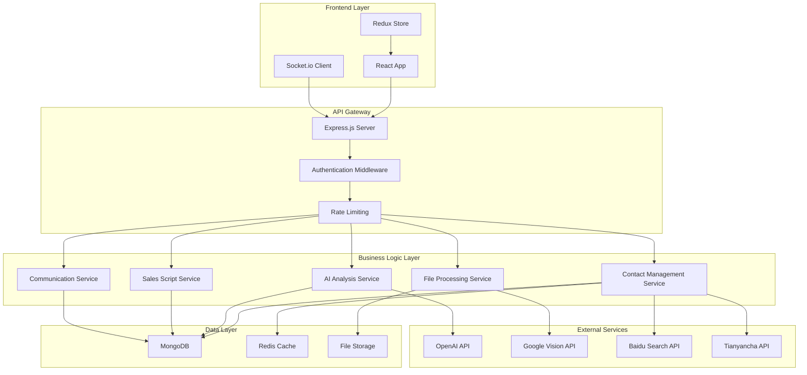

# AI-Driven CRM System Architecture

## 系统概览

AI驱动的CRM系统是一个专注于获客、销售辅助和话术提示的智能客户关系管理平台，作为业务员的AI第二大脑。系统整合了多种销售方法论，包括华尔街之狼的直线销售逻辑、桑德拉的七步销售法、CX（客户体验）、需求机遇地图、OBPPC模型、客户细分、获客AARRR模型、客户旅程地图CJM等，提供主动出击辅助、话术提示和关系构建功能。

### 核心特性
- **智能扩列机制**: AI名片扫描、OCR信息提取、百度搜索人名确认
- **AI客户画像分析**: 基于沟通历史的深度洞察和印象整理
- **销售话术生成**: 集成多种销售方法论的AI话术库
- **联系人分类管理**: 按行业、职级层、年龄层组织的可拖拽文件夹
- **互动历史追踪**: 时间线式沟通记录和AI分析建议
- **专家形象维护**: 社交平台内容推广和亲和力提升
- **天眼查集成**: 自动搜索企业和个人信息

## UI布局架构

### 整体布局设计
系统采用三栏式布局，专为销售人员的工作流程优化：

#### 左侧边栏 (300px)
- **可拖拽联系人列表**: 支持拖拽排序和分组
- **文件夹分类系统**:
  - 行业分类 (科技、金融、制造业等)
  - 职级层分类 (C级、VP、总监、经理等)
  - 年龄层分类 (25-35、35-45、45+等)
- **优先级标签**: 高(红色)、中(黄色)、低(绿色)
- **自定义标签**: 用户可创建个性化标签
- **快速扩列功能**:
  - 名片扫描按钮 (相机图标)
  - 手动添加按钮 (+ 图标)
  - 批量导入按钮 (上传图标)

#### 右侧主面板 (flex-1)
**上方信息栏 (120px)**:
- 联系人头像 (80x80px)
- 基本信息: 姓名、职位、公司
- 联系方式: 电话、微信、邮箱
- 天眼查信息: 企业背景、风险信息

**中部互动历史区域 (flex-1)**:
- 时间线式布局
- 每条记录包含: 日期、沟通内容、附件、话题标签
- AI分析标签: 情绪、兴趣点、痛点
- 下次行动建议卡片

**底部沟通区域 (300px)**:
- 话术生成面板
- 销售方法论选择器
- 今日建议行动
- 成交概率预测

## Technology Stack

### Frontend
- **Framework**: React 18+ with TypeScript
- **State Management**: Redux Toolkit + RTK Query
- **UI Library**: Material-UI (MUI) v5
- **Styling**: Styled-components + CSS-in-JS
- **Charts**: Recharts for analytics
- **File Upload**: React-Dropzone
- **Image Processing**: React-Image-Crop
- **Real-time**: Socket.io-client
- **Drag & Drop**: React DnD for contact management
- **Timeline**: React Timeline for interaction history

### Backend
- **Runtime**: Node.js 18+
- **Framework**: Express.js with TypeScript
- **Authentication**: JWT + Passport.js
- **File Upload**: Multer
- **Image Processing**: Sharp
- **OCR**: Tesseract.js
- **Real-time**: Socket.io
- **API Documentation**: Swagger/OpenAPI

### Database
- **Primary**: MongoDB 6.0+
- **Caching**: Redis
- **Search**: Elasticsearch (optional)
- **File Storage**: AWS S3 / GridFS

### AI/ML Services
- **LLM**: OpenAI GPT-4 API
- **Image Recognition**: Google Vision API
- **OCR**: Google Cloud Vision OCR
- **Search**: Baidu Search API
- **Business Data**: Tianyancha API

### DevOps & Deployment
- **Containerization**: Docker + Docker Compose
- **Orchestration**: Kubernetes
- **CI/CD**: GitHub Actions
- **Monitoring**: Prometheus + Grafana
- **Logging**: ELK Stack
- **Cloud**: AWS/Azure/GCP

## System Architecture



## Database Schema

### MongoDB Collections

#### Users Collection
```javascript
{
  _id: ObjectId,
  email: String,
  password: String, // hashed
  profile: {
    firstName: String,
    lastName: String,
    avatar: String,
    company: String,
    position: String,
    role: String // 'admin', 'sales', 'manager'
  },
  settings: {
    aiPrompts: Object,
    notifications: {
      email: Boolean,
      push: Boolean,
      sms: Boolean
    },
    theme: String,
    language: String,
    timezone: String,
    salesMethodology: String, // 默认销售方法论
    promptTemplates: [String] // 自定义话术模板
  },
  createdAt: Date,
  updatedAt: Date,
  lastLoginAt: Date,
  isActive: Boolean
}
```

#### Contacts Collection
```javascript
{
  _id: ObjectId,
  userId: ObjectId,
  basicInfo: {
    name: String,
    email: String,
    phone: String,
    wechatId: String,
    company: String,
    position: String,
    industry: String,
    ageGroup: String,
    location: String,
    department: String
  },
  photos: [{
    url: String,
    type: String, // 'profile', 'event', 'searched', 'namecard'
    source: String, // 'upload', 'ocr', 'search', 'social'
    uploadedAt: Date,
    ocrData: Object // OCR提取的信息
  }],
  tags: [{
    name: String,
    color: String,
    category: String // 'priority', 'custom', 'industry', 'stage'
  }],
  folder: String,
  priority: Number, // 1=high, 2=medium, 3=low
  socialProfiles: {
    linkedin: String,
    weibo: String,
    xiaohongshu: String,
    wechat: String
  },
  businessInfo: {
    companySize: String,
    revenue: String,
    decisionMaker: Boolean,
    budget: String,
    decisionProcess: String,
    currentSolutions: [String],
    competitors: [String]
  },
  aiProfile: {
    personality: String, // DISC类型
    communicationStyle: String,
    interests: [String],
    painPoints: [String],
    motivations: [String],
    preferredChannels: [String],
    relationshipStrength: Number, // 1-10
    lastAnalysis: Date,
    confidence: Number // AI分析置信度
  },
  salesInfo: {
    stage: String, // 'prospect', 'qualified', 'proposal', 'negotiation', 'closed'
    source: String, // 'referral', 'cold', 'inbound', 'event'
    assignedTo: ObjectId,
    lastContact: Date,
    nextFollowUp: Date,
    opportunityValue: Number,
    probability: Number // 成交概率
  },
  createdAt: Date,
  updatedAt: Date,
  lastInteraction: Date
}
```

#### Interactions Collection
```javascript
{
  _id: ObjectId,
  contactId: ObjectId,
  userId: ObjectId,
  type: String, // 'call', 'wechat', 'email', 'meeting', 'social', 'demo', 'proposal'
  direction: String, // 'inbound', 'outbound'
  content: String,
  summary: String, // AI生成的摘要
  topics: [String],
  sentiment: String, // 'positive', 'neutral', 'negative'
  outcome: String, // 'successful', 'no_answer', 'reschedule', 'objection'
  attachments: [{
    type: String, // 'image', 'document', 'audio', 'video'
    url: String,
    filename: String,
    size: Number
  }],
  metadata: {
    duration: Number, // for calls/meetings (seconds)
    location: String, // for meetings
    platform: String, // for social interactions
    participants: [String], // 其他参与者
    recordingUrl: String, // 录音/录像链接
    transcription: String // 通话转录
  },
  aiAnalysis: {
    keyInsights: [String],
    nextSteps: [String],
    salesStage: String,
    opportunityScore: Number,
    painPointsIdentified: [String],
    objections: [String],
    buyingSignals: [String],
    competitorsMentioned: [String],
    followUpRecommendations: [{
      action: String,
      timing: String,
      priority: String
    }]
  },
  salesMethodology: String, // 使用的销售方法论
  scriptUsed: ObjectId, // 使用的话术模板
  createdAt: Date,
  scheduledAt: Date // 预定时间（如果是预约的互动）
}
```

#### SalesScripts Collection
```javascript
{
  _id: ObjectId,
  userId: ObjectId,
  category: String, // 'opening', 'discovery', 'presentation', 'objection', 'closing', 'follow_up'
  scenario: String,
  methodology: String, // 'straight-line', 'sandler', 'challenger', 'spin', 'consultative'
  industry: String, // 适用行业
  contactLevel: String, // 'c-level', 'vp', 'director', 'manager'
  script: {
    title: String,
    content: String,
    variables: [String], // placeholders for personalization
    effectiveness: Number,
    language: String, // 'zh', 'en'
    tone: String, // 'formal', 'casual', 'friendly'
    estimatedDuration: Number // 预计时长（分钟）
  },
  usage: {
    timesUsed: Number,
    successRate: Number,
    lastUsed: Date,
    avgResponseRate: Number,
    avgConversionRate: Number
  },
  variations: [{
    content: String,
    testResults: {
      usageCount: Number,
      successRate: Number
    }
  }],
  isTemplate: Boolean,
  isPublic: Boolean, // 是否为公共模板
  tags: [String],
  createdAt: Date,
  updatedAt: Date
}
```

#### AIAnalytics Collection
```javascript
{
  _id: ObjectId,
  userId: ObjectId,
  contactId: ObjectId,
  interactionId: ObjectId, // 关联的互动记录
  analysisType: String, // 'profile', 'opportunity', 'script-generation', 'sentiment', 'next-action'
  input: {
    data: Object,
    context: String,
    parameters: Object
  },
  output: {
    result: Object,
    recommendations: [String],
    insights: [String],
    confidence: Number
  },
  model: {
    name: String, // 'gpt-4', 'gpt-3.5-turbo', 'custom'
    version: String,
    provider: String // 'openai', 'azure', 'custom'
  },
  performance: {
    tokens: Number,
    processingTime: Number,
    cost: Number
  },
  feedback: {
    rating: Number, // 1-5
    comments: String,
    isUseful: Boolean
  },
  createdAt: Date
}
```

## Frontend Architecture

### Component Structure
```
src/
├── components/
│   ├── common/
│   │   ├── Layout/
│   │   ├── Navigation/
│   │   ├── Modal/
│   │   └── Loading/
│   ├── contacts/
│   │   ├── ContactList/
│   │   ├── ContactCard/
│   │   ├── ContactDetail/
│   │   └── ContactForm/
│   ├── interactions/
│   │   ├── InteractionHistory/
│   │   ├── InteractionForm/
│   │   └── InteractionCard/
│   ├── ai/
│   │   ├── ProfileAnalysis/
│   │   ├── ScriptGenerator/
│   │   └── OpportunityScore/
│   └── dashboard/
│       ├── Analytics/
│       ├── Pipeline/
│       └── Tasks/
├── hooks/
│   ├── useContacts.ts
│   ├── useAI.ts
│   └── useInteractions.ts
├── store/
│   ├── slices/
│   │   ├── authSlice.ts
│   │   ├── contactsSlice.ts
│   │   ├── interactionsSlice.ts
│   │   └── aiSlice.ts
│   └── api/
│       ├── contactsApi.ts
│       ├── interactionsApi.ts
│       └── aiApi.ts
├── utils/
│   ├── api.ts
│   ├── constants.ts
│   └── helpers.ts
└── types/
    ├── contact.ts
    ├── interaction.ts
    └── ai.ts
```

### Key React Components

#### ContactList Component
```typescript
interface ContactListProps {
  contacts: Contact[];
  selectedContact: Contact | null;
  onContactSelect: (contact: Contact) => void;
  onContactUpdate: (contact: Contact) => void;
}

const ContactList: React.FC<ContactListProps> = ({
  contacts,
  selectedContact,
  onContactSelect,
  onContactUpdate
}) => {
  const [searchTerm, setSearchTerm] = useState('');
  const [filterFolder, setFilterFolder] = useState('');
  const [filterPriority, setFilterPriority] = useState('');
  
  // Component implementation
};
```

#### AIProfileAnalysis Component
```typescript
interface AIProfileAnalysisProps {
  contact: Contact;
  interactions: Interaction[];
  onAnalysisUpdate: (analysis: AIAnalysis) => void;
}

const AIProfileAnalysis: React.FC<AIProfileAnalysisProps> = ({
  contact,
  interactions,
  onAnalysisUpdate
}) => {
  const { generateProfile, isLoading } = useAI();
  
  // Component implementation
};
```

## Backend Architecture

### API Routes Structure
```
routes/
├── auth/
│   ├── login.ts
│   ├── register.ts
│   └── refresh.ts
├── contacts/
│   ├── index.ts
│   ├── create.ts
│   ├── update.ts
│   ├── delete.ts
│   └── search.ts
├── interactions/
│   ├── index.ts
│   ├── create.ts
│   └── analytics.ts
├── ai/
│   ├── analyze-profile.ts
│   ├── generate-script.ts
│   └── opportunity-score.ts
├── files/
│   ├── upload.ts
│   ├── ocr.ts
│   └── process.ts
└── external/
    ├── baidu-search.ts
    └── tianyancha.ts
```

### Core Services

#### AI Service
```typescript
class AIService {
  private openai: OpenAI;
  
  constructor() {
    this.openai = new OpenAI({
      apiKey: process.env.OPENAI_API_KEY
    });
  }
  
  async generateProfileAnalysis(contact: Contact, interactions: Interaction[]): Promise<AIAnalysis> {
    const prompt = this.buildProfilePrompt(contact, interactions);
    
    const response = await this.openai.chat.completions.create({
      model: 'gpt-4',
      messages: [{ role: 'user', content: prompt }],
      temperature: 0.7
    });
    
    return this.parseProfileResponse(response.choices[0].message.content);
  }
  
  async generateSalesScript(contact: Contact, scenario: string, methodology: string): Promise<SalesScript> {
    const prompt = this.buildScriptPrompt(contact, scenario, methodology);
    
    const response = await this.openai.chat.completions.create({
      model: 'gpt-4',
      messages: [{ role: 'user', content: prompt }],
      temperature: 0.8
    });
    
    return this.parseScriptResponse(response.choices[0].message.content);
  }
  
  private buildProfilePrompt(contact: Contact, interactions: Interaction[]): string {
    return `
      Analyze this contact profile and interaction history to generate insights:
      
      Contact: ${contact.basicInfo.name}
      Company: ${contact.basicInfo.company}
      Position: ${contact.basicInfo.position}
      Industry: ${contact.basicInfo.industry}
      
      Interaction History:
      ${interactions.map(i => `${i.type}: ${i.content}`).join('\n')}
      
      Provide analysis in JSON format with:
      - personality assessment
      - communication preferences
      - pain points
      - opportunities
      - next best actions
      - relationship strength (1-10)
    `;
  }
}
```

#### Contact Service
```typescript
class ContactService {
  async createContact(userId: string, contactData: CreateContactDto): Promise<Contact> {
    const contact = new Contact({
      userId,
      ...contactData,
      createdAt: new Date(),
      updatedAt: new Date()
    });
    
    await contact.save();
    
    // Trigger AI analysis
    await this.aiService.generateInitialProfile(contact);
    
    return contact;
  }
  
  async searchContacts(userId: string, query: SearchContactsDto): Promise<Contact[]> {
    const filter: any = { userId };
    
    if (query.search) {
      filter.$or = [
        { 'basicInfo.name': { $regex: query.search, $options: 'i' } },
        { 'basicInfo.company': { $regex: query.search, $options: 'i' } },
        { 'basicInfo.position': { $regex: query.search, $options: 'i' } }
      ];
    }
    
    if (query.folder) {
      filter.folder = query.folder;
    }
    
    if (query.priority) {
      filter.priority = query.priority;
    }
    
    return Contact.find(filter)
      .sort({ updatedAt: -1 })
      .limit(query.limit || 50);
  }
}
```

## Sales Methodology Integration

### 华尔街之狼直线销售法 (Straight Line Selling)
**核心原理:**
- 确定性量表 (1-10分)
- 三大核心确定性:
  1. 产品/服务确定性
  2. 信任和亲和力确定性
  3. 公司确定性

**实施阶段:**
```typescript
const straightLineStages = {
  OPENING: {
    name: '开场白',
    goal: '建立亲和力和权威性',
    duration: '2-3分钟',
    scripts: ['authority_opening', 'rapport_opening', 'value_opening'],
    objectives: ['语调控制', '肢体语言', '第一印象'],
    keyTechniques: ['声音投射', '自信表达', '价值定位']
  },
  INTELLIGENCE_GATHERING: {
    name: '信息收集',
    goal: '了解需求和痛点',
    duration: '5-7分钟',
    scripts: ['needs_discovery', 'pain_exploration', 'current_situation'],
    objectives: ['探索性问题', '积极倾听', '记录要点'],
    keyTechniques: ['开放式提问', '确认技巧', '痛点挖掘']
  },
  PRESENTATION: {
    name: '方案展示',
    goal: '展示匹配需求的解决方案',
    duration: '10-15分钟',
    scripts: ['value_demonstration', 'case_study', 'roi_calculation'],
    objectives: ['利益胜过功能', '描绘愿景', '创造紧迫感'],
    keyTechniques: ['故事化表达', '视觉化展示', '情感连接']
  },
  OBJECTION_HANDLING: {
    name: '异议处理',
    goal: '化解客户疑虑',
    duration: '5-10分钟',
    scripts: ['price_objection', 'timing_objection', 'authority_objection'],
    objectives: ['理解异议', '提供保证', '维持动力'],
    keyTechniques: ['倾听确认', '重新框架', '证据支持']
  },
  CLOSING: {
    name: '成交',
    goal: '要求成交',
    duration: '5-10分钟',
    scripts: ['assumptive_close', 'choice_close', 'urgency_close'],
    objectives: ['假设成交', '处理异议', '创造稀缺性'],
    keyTechniques: ['直接要求', '选择技巧', '时间压力']
  }
};
```

### 桑德勒七步销售法 (Sandler Seven-Step System)
**核心理念:** 颠覆传统销售，让客户主动购买

**七个步骤:**
```typescript
const sandlerSteps = {
  BONDING: {
    step: 1,
    name: '建立融洽关系 (Bonding)',
    goal: '建立信任和舒适感',
    duration: '5-10分钟',
    techniques: ['镜像技巧', '共同话题', '真诚关怀'],
    objectives: ['建立信任', '创造舒适感', '找到共同点'],
    scripts: ['personal_connection', 'common_ground', 'trust_building']
  },
  UP_FRONT_CONTRACT: {
    step: 2,
    name: '前期框架 (Up-front Contract)',
    goal: '设定会议期望和规则',
    duration: '2-3分钟',
    techniques: ['时间框架', '议程设定', '决策流程'],
    objectives: ['设定期望', '定义流程', '获得同意'],
    scripts: ['meeting_agenda', 'time_boundary', 'process_agreement']
  },
  PAIN: {
    step: 3,
    name: '痛点挖掘 (Pain)',
    goal: '发现客户的真实痛点',
    duration: '15-20分钟',
    techniques: ['开放式问题', '痛点量化', '情感连接'],
    objectives: ['识别问题', '量化影响', '情感共鸣'],
    scripts: ['pain_discovery', 'impact_quantification', 'emotional_impact']
  },
  BUDGET: {
    step: 4,
    name: '预算确认 (Budget)',
    goal: '确认客户的投资能力',
    duration: '5-10分钟',
    techniques: ['间接询问', '成本对比', '投资回报'],
    objectives: ['了解投资能力', '财务资格确认'],
    scripts: ['budget_exploration', 'investment_capacity', 'cost_comparison']
  },
  DECISION: {
    step: 5,
    name: '决策流程 (Decision)',
    goal: '了解决策机制和时间线',
    duration: '5-10分钟',
    techniques: ['决策人识别', '流程梳理', '时间确认'],
    objectives: ['识别决策者', '理解流程', '确定时间线'],
    scripts: ['decision_makers', 'decision_process', 'timeline_mapping']
  },
  FULFILLMENT: {
    step: 6,
    name: '方案展示 (Fulfillment)',
    goal: '展示解决方案',
    duration: '10-15分钟',
    techniques: ['针对性展示', '痛点对应', '价值强调'],
    objectives: ['展示解决方案', '匹配痛点', '证明价值'],
    scripts: ['solution_presentation', 'pain_solution_match', 'value_demonstration']
  },
  POST_SELL: {
    step: 7,
    name: '后期框架 (Post-sell)',
    goal: '确认承诺和下一步',
    duration: '5分钟',
    techniques: ['承诺确认', '实施计划', '关系维护'],
    objectives: ['确认决定', '下一步行动', '实施安排'],
    scripts: ['commitment_confirmation', 'implementation_plan', 'next_steps']
  }
};

### 客户体验 (CX) 方法论
**核心理念:** 以客户为中心的全流程体验设计

```typescript
const cxMethodology = {
  AWARENESS: {
    stage: '认知阶段',
    goal: '提升品牌认知度',
    touchpoints: ['社交媒体', '搜索引擎', '口碑推荐'],
    metrics: ['品牌知名度', '搜索量', '社交提及'],
    aiSupport: ['内容推荐', '触点优化', '情感分析']
  },
  CONSIDERATION: {
    stage: '考虑阶段',
    goal: '建立信任和偏好',
    touchpoints: ['官网访问', '内容消费', '销售沟通'],
    metrics: ['页面停留时间', '内容互动率', '询盘转化'],
    aiSupport: ['个性化内容', '行为预测', '需求识别']
  },
  PURCHASE: {
    stage: '购买阶段',
    goal: '促成交易达成',
    touchpoints: ['销售会议', '方案展示', '合同签署'],
    metrics: ['转化率', '成交周期', '客单价'],
    aiSupport: ['话术推荐', '异议处理', '成交预测']
  },
  ONBOARDING: {
    stage: '入职阶段',
    goal: '确保顺利开始',
    touchpoints: ['产品培训', '技术支持', '客户成功'],
    metrics: ['激活率', '使用频率', '满意度'],
    aiSupport: ['个性化培训', '问题预测', '成功路径']
  },
  RETENTION: {
    stage: '保留阶段',
    goal: '维持长期关系',
    touchpoints: ['定期回访', '增值服务', '社区活动'],
    metrics: ['续约率', '使用深度', 'NPS评分'],
    aiSupport: ['流失预警', '增购推荐', '关系维护']
  },
  ADVOCACY: {
    stage: '推荐阶段',
    goal: '转化为品牌大使',
    touchpoints: ['推荐奖励', '案例分享', '社区建设'],
    metrics: ['推荐数量', '案例参与', '社区活跃'],
    aiSupport: ['推荐时机', '激励设计', '影响力评估']
  }
};
```

### OBPPC模型
**核心要素:** Opening, Bonding, Presenting, Probing, Closing

```typescript
const obppcModel = {
  OPENING: {
    name: '开场 (Opening)',
    goal: '吸引注意力，建立初步联系',
    duration: '1-2分钟',
    techniques: ['价值陈述', '问题引入', '故事开场'],
    scripts: ['attention_grabber', 'value_statement', 'story_opening']
  },
  BONDING: {
    name: '建立联系 (Bonding)',
    goal: '建立信任和亲和力',
    duration: '3-5分钟',
    techniques: ['共同点发现', '真诚关怀', '专业展示'],
    scripts: ['trust_building', 'common_ground', 'credibility_establishment']
  },
  PRESENTING: {
    name: '展示 (Presenting)',
    goal: '展示解决方案价值',
    duration: '10-15分钟',
    techniques: ['利益导向', '案例证明', '视觉化展示'],
    scripts: ['solution_presentation', 'benefit_focus', 'proof_points']
  },
  PROBING: {
    name: '探询 (Probing)',
    goal: '深入了解需求和异议',
    duration: '5-10分钟',
    techniques: ['开放式问题', '确认技巧', '异议探索'],
    scripts: ['needs_exploration', 'objection_discovery', 'confirmation_questions']
  },
  CLOSING: {
    name: '成交 (Closing)',
    goal: '获得承诺和下一步行动',
    duration: '3-5分钟',
    techniques: ['试探成交', '假设成交', '紧迫成交'],
    scripts: ['trial_close', 'assumptive_close', 'urgency_close']
  }
};
```

### 获客AARRR模型
**海盗指标:** Acquisition, Activation, Retention, Referral, Revenue

```typescript
const aarrr = {
  ACQUISITION: {
    name: '获客 (Acquisition)',
    goal: '吸引潜在客户',
    channels: ['SEO/SEM', '社交媒体', '内容营销', '线下活动'],
    metrics: ['访问量', '线索数', '获客成本', '渠道转化率'],
    aiSupport: ['渠道优化', '内容推荐', '受众定位']
  },
  ACTIVATION: {
    name: '激活 (Activation)',
    goal: '让用户体验核心价值',
    actions: ['注册试用', '产品演示', '价值体验'],
    metrics: ['激活率', '试用转化', '首次使用'],
    aiSupport: ['个性化引导', '价值匹配', '体验优化']
  },
  RETENTION: {
    name: '留存 (Retention)',
    goal: '保持用户活跃度',
    strategies: ['定期沟通', '价值提醒', '功能升级'],
    metrics: ['留存率', '使用频率', '生命周期'],
    aiSupport: ['流失预警', '个性化服务', '价值提升']
  },
  REFERRAL: {
    name: '推荐 (Referral)',
    goal: '获得用户推荐',
    mechanisms: ['推荐奖励', '口碑营销', '案例分享'],
    metrics: ['推荐率', 'NPS评分', '病毒系数'],
    aiSupport: ['推荐时机', '激励设计', '关系挖掘']
  },
  REVENUE: {
    name: '收入 (Revenue)',
    goal: '实现商业价值',
    strategies: ['增购', '续约', '价格优化'],
    metrics: ['客单价', 'LTV', '收入增长'],
    aiSupport: ['增购推荐', '定价优化', '价值最大化']
  }
};
```

### 客户旅程地图 (CJM)
**全流程客户体验设计**

```typescript
const customerJourneyMap = {
  AWARENESS: {
    stage: '认知阶段',
    customerGoals: ['了解解决方案', '评估市场选项'],
    touchpoints: ['搜索引擎', '社交媒体', '行业报告'],
    emotions: ['好奇', '困惑', '希望'],
    painPoints: ['信息过载', '选择困难', '时间紧迫'],
    opportunities: ['教育内容', '专家定位', '价值展示'],
    aiSupport: ['内容推荐', '搜索优化', '个性化展示']
  },
  CONSIDERATION: {
    stage: '考虑阶段',
    customerGoals: ['比较方案', '验证可行性'],
    touchpoints: ['官网', '销售沟通', '产品演示'],
    emotions: ['兴趣', '谨慎', '期待'],
    painPoints: ['决策压力', '风险担忧', '预算限制'],
    opportunities: ['差异化展示', '风险缓解', 'ROI证明'],
    aiSupport: ['竞品分析', '风险评估', '价值计算']
  },
  DECISION: {
    stage: '决策阶段',
    customerGoals: ['最终选择', '获得批准'],
    touchpoints: ['方案展示', '合同谈判', '内部讨论'],
    emotions: ['紧张', '兴奋', '压力'],
    painPoints: ['内部阻力', '预算审批', '时间压力'],
    opportunities: ['决策支持', '内部推广', '快速响应'],
    aiSupport: ['决策分析', '内部材料', '时机把握']
  },
  IMPLEMENTATION: {
    stage: '实施阶段',
    customerGoals: ['顺利上线', '快速见效'],
    touchpoints: ['项目管理', '培训支持', '技术对接'],
    emotions: ['焦虑', '期待', '满意'],
    painPoints: ['实施复杂', '资源不足', '变更管理'],
    opportunities: ['专业服务', '快速响应', '成功保障'],
    aiSupport: ['进度监控', '问题预测', '资源优化']
  },
  SUCCESS: {
    stage: '成功阶段',
    customerGoals: ['实现价值', '持续优化'],
    touchpoints: ['客户成功', '定期回顾', '增值服务'],
    emotions: ['满意', '信任', '忠诚'],
    painPoints: ['使用深度', '价值实现', '持续改进'],
    opportunities: ['深度合作', '增购机会', '推荐转介'],
    aiSupport: ['价值监控', '优化建议', '增长机会']
  }
};
```

## AI Services Architecture

### 核心AI服务
```typescript
interface AIServiceHub {
  // 话术生成服务
  scriptGeneration: ScriptGenerationService;
  // 客户画像分析
  profileAnalysis: ProfileAnalysisService;
  // 对话分析服务
  conversationAnalysis: ConversationAnalysisService;
  // 行动建议服务
  actionRecommendation: ActionRecommendationService;
  // OCR识别服务
  ocrService: OCRService;
  // 搜索增强服务
  searchEnhancement: SearchEnhancementService;
  // 天眼查集成服务
  tianYanChaService: TianYanChaService;
}

// 话术生成服务
interface ScriptGenerationService {
  generateScript(context: ScriptContext): Promise<SalesScript>;
  optimizeScript(script: SalesScript, feedback: ScriptFeedback): Promise<SalesScript>;
  personalizeScript(script: SalesScript, contact: Contact): Promise<SalesScript>;
  validateScript(script: SalesScript): Promise<ScriptValidation>;
  generateVariations(script: SalesScript, count: number): Promise<SalesScript[]>;
}

interface ScriptContext {
  methodology: SalesMethodology; // 销售方法论
  contactProfile: Contact; // 联系人画像
  conversationHistory: Interaction[]; // 对话历史
  objective: string; // 本次沟通目标
  timeConstraints?: number; // 时间限制
  industry: string; // 行业背景
  contactLevel: string; // 联系人级别
  previousScripts?: SalesScript[]; // 之前使用的话术
  currentStage: string; // 当前销售阶段
  competitorInfo?: string[]; // 竞争对手信息
}

// 客户画像分析服务
interface ProfileAnalysisService {
  analyzeProfile(contact: Contact, interactions: Interaction[]): Promise<AIProfile>;
  updateProfile(contactId: string, newInteraction: Interaction): Promise<AIProfile>;
  generateInsights(profile: AIProfile): Promise<CustomerInsight[]>;
  predictBehavior(profile: AIProfile): Promise<BehaviorPrediction>;
  assessOpportunity(profile: AIProfile): Promise<OpportunityAssessment>;
  recommendStrategy(profile: AIProfile): Promise<StrategyRecommendation>;
}

interface AIProfile {
  personality: DISCProfile; // DISC性格分析
  communicationStyle: CommunicationStyle;
  interests: string[];
  painPoints: PainPoint[];
  motivations: string[];
  decisionMakingStyle: DecisionStyle;
  relationshipStrength: number; // 1-10
  buyingSignals: BuyingSignal[];
  riskFactors: RiskFactor[];
  confidence: number; // AI分析置信度
  lastUpdated: Date;
  industryContext: IndustryContext;
  competitivePosition: CompetitivePosition;
}

// OCR识别服务
interface OCRService {
  extractBusinessCard(imageUrl: string): Promise<BusinessCardData>;
  enhanceContactInfo(ocrData: BusinessCardData): Promise<EnhancedContactInfo>;
  validateExtractedData(data: BusinessCardData): Promise<ValidationResult>;
  processMultipleCards(imageUrls: string[]): Promise<BusinessCardData[]>;
}

interface BusinessCardData {
  name: string;
  title: string;
  company: string;
  phone: string;
  email: string;
  address: string;
  website: string;
  socialMedia: SocialMediaInfo[];
  confidence: number;
  rawText: string;
  extractedFields: ExtractedField[];
  processingMetadata: ProcessingMetadata;
}

// 天眼查集成服务
interface TianYanChaService {
  searchCompany(companyName: string): Promise<CompanyInfo>;
  getCompanyRisk(companyName: string): Promise<RiskAssessment>;
  getExecutiveInfo(personName: string, companyName?: string): Promise<ExecutiveInfo>;
  getIndustryAnalysis(industry: string): Promise<IndustryAnalysis>;
  verifyBusinessInfo(businessInfo: BusinessInfo): Promise<VerificationResult>;
}

interface CompanyInfo {
  basicInfo: CompanyBasicInfo;
  businessScope: string[];
  registeredCapital: string;
  establishDate: Date;
  legalRepresentative: string;
  businessStatus: string;
  riskLevel: 'low' | 'medium' | 'high';
  creditRating: string;
  industryCategory: string;
  employeeCount: string;
  annualRevenue: string;
  keyPersonnel: KeyPersonnel[];
  businessRelations: BusinessRelation[];
  riskEvents: RiskEvent[];
}
```

## AI Prompt Templates

### Profile Analysis Prompt
```typescript
const PROFILE_ANALYSIS_PROMPT = `
You are an expert sales psychologist and relationship analyst. Analyze the following contact information and interaction history to create a comprehensive profile.

Contact Information:
{contactInfo}

Interaction History:
{interactionHistory}

Provide analysis in the following JSON format:
{
  "personality": {
    "type": "DISC type (D/I/S/C)",
    "traits": ["list of key personality traits"],
    "communication_style": "preferred communication approach"
  },
  "business_profile": {
    "decision_authority": "high/medium/low",
    "influence_level": "high/medium/low",
    "budget_authority": "high/medium/low",
    "pain_points": ["identified business challenges"],
    "priorities": ["current business priorities"]
  },
  "relationship_insights": {
    "rapport_level": "scale 1-10",
    "trust_indicators": ["signs of trust"],
    "engagement_level": "high/medium/low",
    "preferred_topics": ["topics that resonate"]
  },
  "sales_strategy": {
    "current_stage": "awareness/interest/consideration/decision",
    "next_best_actions": ["recommended next steps"],
    "timing_recommendations": "when to follow up",
    "approach_strategy": "how to approach next interaction"
  },
  "opportunity_assessment": {
    "score": "1-100",
    "likelihood": "high/medium/low",
    "timeline": "estimated decision timeline",
    "potential_value": "estimated deal size category"
  }
}
`;
```

### Script Generation Prompt
```typescript
const SCRIPT_GENERATION_PROMPT = `
You are a master sales trainer specializing in {methodology} sales methodology. Generate a personalized sales script for the following scenario.

Contact Profile:
{contactProfile}

Current Situation:
{currentSituation}

Sales Stage: {salesStage}
Objective: {objective}

Generate a script that includes:
1. Opening statement
2. Key talking points
3. Questions to ask
4. Potential objections and responses
5. Closing statement

Format as JSON:
{
  "opening": "personalized opening statement",
  "talking_points": ["key points to cover"],
  "questions": ["strategic questions to ask"],
  "objection_handling": {
    "common_objection_1": "response strategy",
    "common_objection_2": "response strategy"
  },
  "closing": "next step request",
  "personalization_notes": ["specific personalization elements used"]
}
`;
```

## Deployment Architecture

### Docker Configuration

#### docker-compose.yml
```yaml
version: '3.8'

services:
  frontend:
    build:
      context: ./frontend
      dockerfile: Dockerfile
    ports:
      - "3000:3000"
    environment:
      - REACT_APP_API_URL=http://backend:5000
    depends_on:
      - backend

  backend:
    build:
      context: ./backend
      dockerfile: Dockerfile
    ports:
      - "5000:5000"
    environment:
      - NODE_ENV=production
      - MONGODB_URI=mongodb://mongo:27017/crm
      - REDIS_URL=redis://redis:6379
      - JWT_SECRET=${JWT_SECRET}
      - OPENAI_API_KEY=${OPENAI_API_KEY}
    depends_on:
      - mongo
      - redis
    volumes:
      - ./uploads:/app/uploads

  mongo:
    image: mongo:6.0
    ports:
      - "27017:27017"
    volumes:
      - mongo_data:/data/db
    environment:
      - MONGO_INITDB_ROOT_USERNAME=admin
      - MONGO_INITDB_ROOT_PASSWORD=${MONGO_PASSWORD}

  redis:
    image: redis:7-alpine
    ports:
      - "6379:6379"
    volumes:
      - redis_data:/data

  nginx:
    image: nginx:alpine
    ports:
      - "80:80"
      - "443:443"
    volumes:
      - ./nginx.conf:/etc/nginx/nginx.conf
      - ./ssl:/etc/nginx/ssl
    depends_on:
      - frontend
      - backend

volumes:
  mongo_data:
  redis_data:
```

### Kubernetes Deployment

#### k8s/deployment.yaml
```yaml
apiVersion: apps/v1
kind: Deployment
metadata:
  name: crm-backend
spec:
  replicas: 3
  selector:
    matchLabels:
      app: crm-backend
  template:
    metadata:
      labels:
        app: crm-backend
    spec:
      containers:
      - name: backend
        image: crm-backend:latest
        ports:
        - containerPort: 5000
        env:
        - name: MONGODB_URI
          valueFrom:
            secretKeyRef:
              name: crm-secrets
              key: mongodb-uri
        - name: OPENAI_API_KEY
          valueFrom:
            secretKeyRef:
              name: crm-secrets
              key: openai-api-key
        resources:
          requests:
            memory: "256Mi"
            cpu: "250m"
          limits:
            memory: "512Mi"
            cpu: "500m"
---
apiVersion: v1
kind: Service
metadata:
  name: crm-backend-service
spec:
  selector:
    app: crm-backend
  ports:
  - port: 80
    targetPort: 5000
  type: LoadBalancer
```

## Security Considerations

### Authentication & Authorization
```typescript
// JWT middleware
const authenticateToken = (req: Request, res: Response, next: NextFunction) => {
  const authHeader = req.headers['authorization'];
  const token = authHeader && authHeader.split(' ')[1];
  
  if (!token) {
    return res.sendStatus(401);
  }
  
  jwt.verify(token, process.env.JWT_SECRET!, (err: any, user: any) => {
    if (err) return res.sendStatus(403);
    req.user = user;
    next();
  });
};

// Rate limiting
const limiter = rateLimit({
  windowMs: 15 * 60 * 1000, // 15 minutes
  max: 100, // limit each IP to 100 requests per windowMs
  message: 'Too many requests from this IP'
});

// Data validation
const validateContact = [
  body('basicInfo.name').isLength({ min: 1 }).trim().escape(),
  body('basicInfo.email').isEmail().normalizeEmail(),
  body('basicInfo.phone').isMobilePhone('any'),
];
```

### Data Privacy
```typescript
// Data encryption for sensitive fields
const encryptSensitiveData = (data: any) => {
  const cipher = crypto.createCipher('aes-256-cbc', process.env.ENCRYPTION_KEY!);
  let encrypted = cipher.update(JSON.stringify(data), 'utf8', 'hex');
  encrypted += cipher.final('hex');
  return encrypted;
};

// GDPR compliance
const anonymizeContact = async (contactId: string) => {
  await Contact.findByIdAndUpdate(contactId, {
    'basicInfo.name': 'Anonymized User',
    'basicInfo.email': 'anonymized@example.com',
    'basicInfo.phone': 'XXXXXXXXXX',
    'photos': [],
    'aiProfile': {}
  });
};
```

## Performance Optimization

### Caching Strategy
```typescript
// Redis caching for AI responses
class CacheService {
  private redis: Redis;
  
  constructor() {
    this.redis = new Redis(process.env.REDIS_URL!);
  }
  
  async cacheAIResponse(key: string, response: any, ttl: number = 3600) {
    await this.redis.setex(key, ttl, JSON.stringify(response));
  }
  
  async getCachedAIResponse(key: string): Promise<any | null> {
    const cached = await this.redis.get(key);
    return cached ? JSON.parse(cached) : null;
  }
  
  generateCacheKey(type: string, contactId: string, ...params: string[]): string {
    return `ai:${type}:${contactId}:${params.join(':')}`;
  }
}
```

### Database Indexing
```javascript
// MongoDB indexes for optimal performance
db.contacts.createIndex({ "userId": 1, "updatedAt": -1 });
db.contacts.createIndex({ "userId": 1, "basicInfo.name": "text", "basicInfo.company": "text" });
db.contacts.createIndex({ "userId": 1, "folder": 1, "priority": 1 });
db.interactions.createIndex({ "contactId": 1, "createdAt": -1 });
db.interactions.createIndex({ "userId": 1, "type": 1, "createdAt": -1 });
```

## Monitoring & Analytics

### Application Metrics
```typescript
// Prometheus metrics
const promClient = require('prom-client');

const httpRequestDuration = new promClient.Histogram({
  name: 'http_request_duration_seconds',
  help: 'Duration of HTTP requests in seconds',
  labelNames: ['method', 'route', 'status']
});

const aiRequestCounter = new promClient.Counter({
  name: 'ai_requests_total',
  help: 'Total number of AI API requests',
  labelNames: ['type', 'model', 'status']
});

const activeUsers = new promClient.Gauge({
  name: 'active_users',
  help: 'Number of active users'
});
```

## Development Setup

### Prerequisites
```bash
# Required software
Node.js 18+
MongoDB 6.0+
Redis 7+
Docker & Docker Compose
```

### Installation Steps
```bash
# Clone repository
git clone <repository-url>
cd ai-crm

# Install dependencies
cd frontend && npm install
cd ../backend && npm install

# Set up environment variables
cp .env.example .env
# Edit .env with your configuration

# Start development environment
docker-compose -f docker-compose.dev.yml up

# Run migrations
npm run migrate

# Start development servers
npm run dev:frontend
npm run dev:backend
```

### Environment Variables
```bash
# Backend .env
NODE_ENV=development
PORT=5000
MONGODB_URI=mongodb://localhost:27017/crm
REDIS_URL=redis://localhost:6379
JWT_SECRET=your-jwt-secret
ENCRYPTION_KEY=your-encryption-key

# AI Services
OPENAI_API_KEY=your-openai-key
GOOGLE_VISION_API_KEY=your-google-vision-key
BAIDU_API_KEY=your-baidu-key
TIANYANCHA_API_KEY=your-tianyancha-key

# File Storage
AWS_ACCESS_KEY_ID=your-aws-key
AWS_SECRET_ACCESS_KEY=your-aws-secret
AWS_S3_BUCKET=your-s3-bucket

# Frontend .env
REACT_APP_API_URL=http://localhost:5000
REACT_APP_SOCKET_URL=http://localhost:5000
```

## Testing Strategy

### Unit Tests
```typescript
// Contact service test
describe('ContactService', () => {
  let contactService: ContactService;
  
  beforeEach(() => {
    contactService = new ContactService();
  });
  
  describe('createContact', () => {
    it('should create a new contact with AI analysis', async () => {
      const contactData = {
        basicInfo: {
          name: 'John Doe',
          email: 'john@example.com',
          company: 'Acme Corp'
        }
      };
      
      const contact = await contactService.createContact('user123', contactData);
      
      expect(contact).toBeDefined();
      expect(contact.basicInfo.name).toBe('John Doe');
      expect(contact.aiProfile).toBeDefined();
    });
  });
});
```

### Integration Tests
```typescript
// API integration test
describe('Contacts API', () => {
  it('should create and retrieve contacts', async () => {
    const response = await request(app)
      .post('/api/contacts')
      .set('Authorization', `Bearer ${authToken}`)
      .send({
        basicInfo: {
          name: 'Test Contact',
          email: 'test@example.com'
        }
      })
      .expect(201);
    
    const contactId = response.body.id;
    
    const getResponse = await request(app)
      .get(`/api/contacts/${contactId}`)
      .set('Authorization', `Bearer ${authToken}`)
      .expect(200);
    
    expect(getResponse.body.basicInfo.name).toBe('Test Contact');
  });
});
```

## Scalability Considerations

### Horizontal Scaling
- **Microservices**: Split into contact, interaction, AI, and file services
- **Load Balancing**: Use NGINX or AWS ALB for traffic distribution
- **Database Sharding**: Shard by userId for horizontal scaling
- **CDN**: Use CloudFront for static asset delivery

### Performance Optimization
- **Connection Pooling**: MongoDB and Redis connection pools
- **Lazy Loading**: Implement pagination and virtual scrolling
- **Image Optimization**: Compress and resize images automatically
- **AI Response Caching**: Cache AI responses for similar queries

### Monitoring & Alerting
- **Health Checks**: Implement comprehensive health endpoints
- **Error Tracking**: Use Sentry for error monitoring
- **Performance Monitoring**: APM with New Relic or DataDog
- **Log Aggregation**: Centralized logging with ELK stack

This architecture provides a comprehensive, scalable, and maintainable foundation for an AI-driven CRM system that integrates advanced sales methodologies with modern web technologies.