# Backend Architecture - AI-Driven CRM System

## 后端架构概览

### 技术栈
- **Node.js**: JavaScript运行时环境
- **Express.js**: Web应用框架
- **TypeScript**: 类型安全的JavaScript开发
- **MongoDB**: 文档数据库
- **Mongoose**: MongoDB对象建模工具
- **Redis**: 内存数据库，用于缓存和会话
- **Socket.io**: 实时双向通信
- **JWT**: JSON Web Token认证
- **Multer**: 文件上传处理
- **Bull**: 任务队列管理

## 服务架构图

```mermaid
graph TB
    subgraph "API Gateway Layer"
        NGINX[Nginx反向代理]
        RATE_LIMITER[速率限制]
        CORS[CORS处理]
        AUTH_MIDDLEWARE[认证中间件]
    end

    subgraph "Application Layer"
        EXPRESS[Express.js应用]
        
        subgraph "Controllers"
            AUTH_CTRL[AuthController]
            CONTACT_CTRL[ContactController]
            INTERACTION_CTRL[InteractionController]
            AI_CTRL[AIController]
            FILE_CTRL[FileController]
            USER_CTRL[UserController]
            ANALYTICS_CTRL[AnalyticsController]
        end
        
        subgraph "Services"
            AUTH_SVC[AuthService]
            CONTACT_SVC[ContactService]
            INTERACTION_SVC[InteractionService]
            AI_SVC[AIService]
            FILE_SVC[FileService]
            EMAIL_SVC[EmailService]
            NOTIFICATION_SVC[NotificationService]
        end
        
        subgraph "AI Services"
            SCRIPT_AI[ScriptGenerationService]
            PROFILE_AI[ProfileAnalysisService]
            OCR_AI[OCRService]
            CONVERSATION_AI[ConversationAnalysisService]
            RECOMMENDATION_AI[RecommendationService]
        end
    end

    subgraph "Data Access Layer"
        subgraph "Repositories"
            USER_REPO[UserRepository]
            CONTACT_REPO[ContactRepository]
            INTERACTION_REPO[InteractionRepository]
            AI_REPO[AIRepository]
            FILE_REPO[FileRepository]
        end
        
        subgraph "Models"
            USER_MODEL[User Model]
            CONTACT_MODEL[Contact Model]
            INTERACTION_MODEL[Interaction Model]
            AI_MODEL[AI Model]
            FILE_MODEL[File Model]
        end
    end

    subgraph "External Services"
        OPENAI[OpenAI API]
        BAIDU_AI[百度AI]
        TIANYANCHA[天眼查API]
        GOOGLE_VISION[Google Vision]
        WECHAT_API[微信API]
        LINKEDIN_API[LinkedIn API]
    end

    subgraph "Data Storage"
        MONGODB[(MongoDB)]
        REDIS[(Redis)]
        FILE_STORAGE[文件存储]
    end

    subgraph "Background Jobs"
        BULL_QUEUE[Bull队列]
        AI_JOBS[AI处理任务]
        EMAIL_JOBS[邮件任务]
        SYNC_JOBS[数据同步任务]
    end

    %% 连接关系
    NGINX --> EXPRESS
    EXPRESS --> AUTH_CTRL
    EXPRESS --> CONTACT_CTRL
    EXPRESS --> AI_CTRL
    
    AUTH_CTRL --> AUTH_SVC
    CONTACT_CTRL --> CONTACT_SVC
    AI_CTRL --> AI_SVC
    
    AI_SVC --> SCRIPT_AI
    AI_SVC --> PROFILE_AI
    AI_SVC --> OCR_AI
    
    CONTACT_SVC --> CONTACT_REPO
    CONTACT_REPO --> CONTACT_MODEL
    CONTACT_MODEL --> MONGODB
    
    AI_SVC --> OPENAI
    AI_SVC --> BAIDU_AI
    AI_SVC --> TIANYANCHA
    
    EXPRESS --> BULL_QUEUE
    BULL_QUEUE --> AI_JOBS
    
    AUTH_SVC --> REDIS
    CONTACT_SVC --> REDIS
```



## 目录结构

```
backend/
├── src/
│   ├── controllers/          # 控制器层
│   │   ├── auth.controller.ts
│   │   ├── contact.controller.ts
│   │   ├── interaction.controller.ts
│   │   ├── ai.controller.ts
│   │   ├── file.controller.ts
│   │   └── analytics.controller.ts
│   ├── services/             # 业务逻辑层
│   │   ├── auth.service.ts
│   │   ├── contact.service.ts
│   │   ├── interaction.service.ts
│   │   ├── ai.service.ts
│   │   ├── file.service.ts
│   │   ├── email.service.ts
│   │   └── notification.service.ts
│   ├── repositories/         # 数据访问层
│   │   ├── base.repository.ts
│   │   ├── user.repository.ts
│   │   ├── contact.repository.ts
│   │   ├── interaction.repository.ts
│   │   └── ai.repository.ts
│   ├── models/              # 数据模型
│   │   ├── user.model.ts
│   │   ├── contact.model.ts
│   │   ├── interaction.model.ts
│   │   ├── ai-script.model.ts
│   │   └── file.model.ts
│   ├── middleware/          # 中间件
│   │   ├── auth.middleware.ts
│   │   ├── validation.middleware.ts
│   │   ├── error.middleware.ts
│   │   ├── rate-limit.middleware.ts
│   │   └── upload.middleware.ts
│   ├── routes/              # 路由定义
│   │   ├── auth.routes.ts
│   │   ├── contact.routes.ts
│   │   ├── interaction.routes.ts
│   │   ├── ai.routes.ts
│   │   └── file.routes.ts
│   ├── utils/               # 工具函数
│   │   ├── logger.ts
│   │   ├── validator.ts
│   │   ├── encryption.ts
│   │   ├── jwt.ts
│   │   └── constants.ts
│   ├── config/              # 配置文件
│   │   ├── database.ts
│   │   ├── redis.ts
│   │   ├── ai.ts
│   │   └── app.ts
│   ├── jobs/                # 后台任务
│   │   ├── ai-analysis.job.ts
│   │   ├── email.job.ts
│   │   └── data-sync.job.ts
│   ├── types/               # TypeScript类型定义
│   │   ├── auth.types.ts
│   │   ├── contact.types.ts
│   │   ├── ai.types.ts
│   │   └── common.types.ts
│   └── app.ts               # 应用入口
├── tests/                   # 测试文件
├── docs/                    # API文档
├── package.json
├── tsconfig.json
└── Dockerfile
```

## 核心组件详细设计

### 1. 控制器层 (Controllers)

#### ContactController
```typescript
import { Request, Response, NextFunction } from 'express';
import { ContactService } from '../services/contact.service';
import { AIService } from '../services/ai.service';
import { validateContactData } from '../utils/validator';
import { AuthenticatedRequest } from '../types/auth.types';

export class ContactController {
  constructor(
    private contactService: ContactService,
    private aiService: AIService
  ) {}

  /**
   * 获取联系人列表
   */
  async getContacts(req: AuthenticatedRequest, res: Response, next: NextFunction) {
    try {
      const { page = 1, limit = 20, search, folder, tags, priority } = req.query;
      const userId = req.user!.id;

      const filters = {
        userId,
        ...(search && { $text: { $search: search as string } }),
        ...(folder && { folder: folder as string }),
        ...(tags && { tags: { $in: (tags as string).split(',') } }),
        ...(priority && { priority: priority as string })
      };

      const result = await this.contactService.getContacts({
        filters,
        page: Number(page),
        limit: Number(limit),
        sort: { updatedAt: -1 }
      });

      res.json({
        success: true,
        data: result.contacts,
        pagination: {
          page: result.page,
          limit: result.limit,
          total: result.total,
          pages: result.pages
        }
      });
    } catch (error) {
      next(error);
    }
  }

  /**
   * 创建联系人
   */
  async createContact(req: AuthenticatedRequest, res: Response, next: NextFunction) {
    try {
      const contactData = validateContactData(req.body);
      const userId = req.user!.id;

      const contact = await this.contactService.createContact({
        ...contactData,
        userId
      });

      // 异步生成AI画像
      this.aiService.generateProfileAsync(contact.id).catch(console.error);

      res.status(201).json({
        success: true,
        data: contact
      });
    } catch (error) {
      next(error);
    }
  }

  /**
   * 更新联系人
   */
  async updateContact(req: AuthenticatedRequest, res: Response, next: NextFunction) {
    try {
      const { id } = req.params;
      const updates = validateContactData(req.body, { partial: true });
      const userId = req.user!.id;

      const contact = await this.contactService.updateContact(id, updates, userId);
      
      if (!contact) {
        return res.status(404).json({
          success: false,
          message: 'Contact not found'
        });
      }

      // 如果更新了关键信息，重新生成AI画像
      if (updates.company || updates.position || updates.industry) {
        this.aiService.generateProfileAsync(contact.id).catch(console.error);
      }

      res.json({
        success: true,
        data: contact
      });
    } catch (error) {
      next(error);
    }
  }

  /**
   * 批量导入联系人
   */
  async bulkImport(req: AuthenticatedRequest, res: Response, next: NextFunction) {
    try {
      const { contacts } = req.body;
      const userId = req.user!.id;

      const result = await this.contactService.bulkImport(contacts, userId);

      res.json({
        success: true,
        data: {
          imported: result.successful.length,
          failed: result.failed.length,
          errors: result.failed
        }
      });
    } catch (error) {
      next(error);
    }
  }

  /**
   * 移动联系人到文件夹
   */
  async moveToFolder(req: AuthenticatedRequest, res: Response, next: NextFunction) {
    try {
      const { contactIds, folderId } = req.body;
      const userId = req.user!.id;

      await this.contactService.moveContactsToFolder(contactIds, folderId, userId);

      res.json({
        success: true,
        message: 'Contacts moved successfully'
      });
    } catch (error) {
      next(error);
    }
  }
}
```

#### AIController
```typescript
import { Request, Response, NextFunction } from 'express';
import { AIService } from '../services/ai.service';
import { ContactService } from '../services/contact.service';
import { InteractionService } from '../services/interaction.service';
import { AuthenticatedRequest } from '../types/auth.types';
import { ScriptGenerationRequest, ProfileAnalysisRequest } from '../types/ai.types';

export class AIController {
  constructor(
    private aiService: AIService,
    private contactService: ContactService,
    private interactionService: InteractionService
  ) {}

  /**
   * 生成销售话术
   */
  async generateScript(req: AuthenticatedRequest, res: Response, next: NextFunction) {
    try {
      const {
        contactId,
        methodology,
        objective,
        timeConstraints,
        customPrompt
      }: ScriptGenerationRequest = req.body;
      
      const userId = req.user!.id;

      // 获取联系人信息
      const contact = await this.contactService.getContactById(contactId, userId);
      if (!contact) {
        return res.status(404).json({
          success: false,
          message: 'Contact not found'
        });
      }

      // 获取互动历史
      const interactions = await this.interactionService.getInteractionsByContact(
        contactId,
        { limit: 10, sort: { createdAt: -1 } }
      );

      // 生成话术
      const script = await this.aiService.generateSalesScript({
        contact,
        interactions: interactions.interactions,
        methodology,
        objective,
        timeConstraints,
        customPrompt,
        userId
      });

      res.json({
        success: true,
        data: script
      });
    } catch (error) {
      next(error);
    }
  }

  /**
   * 分析联系人画像
   */
  async analyzeProfile(req: AuthenticatedRequest, res: Response, next: NextFunction) {
    try {
      const { contactId } = req.params;
      const userId = req.user!.id;

      const contact = await this.contactService.getContactById(contactId, userId);
      if (!contact) {
        return res.status(404).json({
          success: false,
          message: 'Contact not found'
        });
      }

      const interactions = await this.interactionService.getInteractionsByContact(
        contactId,
        { limit: 20, sort: { createdAt: -1 } }
      );

      const profile = await this.aiService.analyzeContactProfile({
        contact,
        interactions: interactions.interactions,
        userId
      });

      res.json({
        success: true,
        data: profile
      });
    } catch (error) {
      next(error);
    }
  }

  /**
   * OCR名片识别
   */
  async extractBusinessCard(req: AuthenticatedRequest, res: Response, next: NextFunction) {
    try {
      if (!req.file) {
        return res.status(400).json({
          success: false,
          message: 'No image file provided'
        });
      }

      const extractedData = await this.aiService.extractBusinessCardData(req.file);

      // 可选：通过百度搜索验证人名
      if (extractedData.name) {
        const searchResults = await this.aiService.searchPersonInfo(extractedData.name);
        extractedData.searchResults = searchResults;
      }

      res.json({
        success: true,
        data: extractedData
      });
    } catch (error) {
      next(error);
    }
  }

  /**
   * 获取下一步行动建议
   */
  async getActionRecommendations(req: AuthenticatedRequest, res: Response, next: NextFunction) {
    try {
      const { contactId } = req.params;
      const userId = req.user!.id;

      const contact = await this.contactService.getContactById(contactId, userId);
      if (!contact) {
        return res.status(404).json({
          success: false,
          message: 'Contact not found'
        });
      }

      const interactions = await this.interactionService.getInteractionsByContact(
        contactId,
        { limit: 10, sort: { createdAt: -1 } }
      );

      const recommendations = await this.aiService.generateActionRecommendations({
        contact,
        interactions: interactions.interactions,
        userId
      });

      res.json({
        success: true,
        data: recommendations
      });
    } catch (error) {
      next(error);
    }
  }

  /**
   * 分析对话内容
   */
  async analyzeConversation(req: AuthenticatedRequest, res: Response, next: NextFunction) {
    try {
      const { interactionId } = req.params;
      const userId = req.user!.id;

      const interaction = await this.interactionService.getInteractionById(
        interactionId,
        userId
      );
      
      if (!interaction) {
        return res.status(404).json({
          success: false,
          message: 'Interaction not found'
        });
      }

      const analysis = await this.aiService.analyzeConversation({
        interaction,
        userId
      });

      // 更新互动记录的AI分析
      await this.interactionService.updateInteraction(
        interactionId,
        { aiAnalysis: analysis },
        userId
      );

      res.json({
        success: true,
        data: analysis
      });
    } catch (error) {
      next(error);
    }
  }
}
```

### 2. 服务层 (Services)

#### AIService
```typescript
import { OpenAI } from 'openai';
import { BaiduAIClient } from '../utils/baidu-ai';
import { TianYanChaClient } from '../utils/tianyancha';
import { ContactRepository } from '../repositories/contact.repository';
import { AIRepository } from '../repositories/ai.repository';
import { InteractionRepository } from '../repositories/interaction.repository';
import {
  ScriptGenerationContext,
  ProfileAnalysisContext,
  ConversationAnalysisContext,
  ActionRecommendationContext,
  SalesScript,
  AIProfile,
  ConversationAnalysis,
  ActionRecommendation,
  BusinessCardData
} from '../types/ai.types';
import { logger } from '../utils/logger';
import { SALES_METHODOLOGIES, AI_PROMPTS } from '../config/ai';

export class AIService {
  private openai: OpenAI;
  private baiduAI: BaiduAIClient;
  private tianYanCha: TianYanChaClient;

  constructor(
    private contactRepository: ContactRepository,
    private aiRepository: AIRepository,
    private interactionRepository: InteractionRepository
  ) {
    this.openai = new OpenAI({
      apiKey: process.env.OPENAI_API_KEY
    });
    this.baiduAI = new BaiduAIClient();
    this.tianYanCha = new TianYanChaClient();
  }

  /**
   * 生成销售话术
   */
  async generateSalesScript(context: ScriptGenerationContext): Promise<SalesScript> {
    try {
      const { contact, interactions, methodology, objective, timeConstraints, customPrompt } = context;

      // 构建提示词
      const methodologyPrompt = SALES_METHODOLOGIES[methodology];
      const systemPrompt = this.buildScriptSystemPrompt(methodologyPrompt, timeConstraints);
      const userPrompt = this.buildScriptUserPrompt({
        contact,
        interactions,
        objective,
        customPrompt
      });

      // 调用OpenAI生成话术
      const completion = await this.openai.chat.completions.create({
        model: 'gpt-4-turbo-preview',
        messages: [
          { role: 'system', content: systemPrompt },
          { role: 'user', content: userPrompt }
        ],
        temperature: 0.7,
        max_tokens: 2000
      });

      const scriptContent = completion.choices[0]?.message?.content;
      if (!scriptContent) {
        throw new Error('Failed to generate script content');
      }

      // 解析生成的话术
      const parsedScript = this.parseScriptResponse(scriptContent);

      // 保存到数据库
      const script: SalesScript = {
        id: this.generateId(),
        contactId: contact.id,
        userId: context.userId,
        methodology,
        objective,
        content: parsedScript,
        metadata: {
          model: 'gpt-4-turbo-preview',
          tokens: completion.usage?.total_tokens || 0,
          generatedAt: new Date(),
          timeConstraints
        },
        createdAt: new Date(),
        updatedAt: new Date()
      };

      await this.aiRepository.saveScript(script);

      logger.info('Sales script generated', {
        contactId: contact.id,
        methodology,
        tokens: completion.usage?.total_tokens
      });

      return script;
    } catch (error) {
      logger.error('Failed to generate sales script', { error, context });
      throw error;
    }
  }

  /**
   * 分析联系人画像
   */
  async analyzeContactProfile(context: ProfileAnalysisContext): Promise<AIProfile> {
    try {
      const { contact, interactions } = context;

      // 构建分析提示词
      const systemPrompt = AI_PROMPTS.PROFILE_ANALYSIS_SYSTEM;
      const userPrompt = this.buildProfileAnalysisPrompt(contact, interactions);

      // 调用OpenAI分析
      const completion = await this.openai.chat.completions.create({
        model: 'gpt-4-turbo-preview',
        messages: [
          { role: 'system', content: systemPrompt },
          { role: 'user', content: userPrompt }
        ],
        temperature: 0.3,
        max_tokens: 1500,
        response_format: { type: 'json_object' }
      });

      const analysisContent = completion.choices[0]?.message?.content;
      if (!analysisContent) {
        throw new Error('Failed to generate profile analysis');
      }

      const parsedAnalysis = JSON.parse(analysisContent);

      // 获取天眼查信息（如果有公司信息）
      let companyInfo = null;
      if (contact.company?.name) {
        try {
          companyInfo = await this.tianYanCha.getCompanyInfo(contact.company.name);
        } catch (error) {
          logger.warn('Failed to fetch TianYanCha info', { error, company: contact.company.name });
        }
      }

      // 构建AI画像
      const profile: AIProfile = {
        id: this.generateId(),
        contactId: contact.id,
        userId: context.userId,
        personality: parsedAnalysis.personality,
        businessInsights: parsedAnalysis.businessInsights,
        relationshipInsights: parsedAnalysis.relationshipInsights,
        salesStrategy: parsedAnalysis.salesStrategy,
        opportunityAssessment: parsedAnalysis.opportunityAssessment,
        companyInfo,
        confidence: parsedAnalysis.confidence || 0.8,
        lastAnalyzedAt: new Date(),
        metadata: {
          model: 'gpt-4-turbo-preview',
          tokens: completion.usage?.total_tokens || 0,
          interactionsAnalyzed: interactions.length
        },
        createdAt: new Date(),
        updatedAt: new Date()
      };

      // 保存到数据库
      await this.aiRepository.saveProfile(profile);

      // 更新联系人的AI画像引用
      await this.contactRepository.updateContact(contact.id, {
        aiProfileId: profile.id,
        lastAIAnalysis: new Date()
      });

      logger.info('Contact profile analyzed', {
        contactId: contact.id,
        confidence: profile.confidence,
        tokens: completion.usage?.total_tokens
      });

      return profile;
    } catch (error) {
      logger.error('Failed to analyze contact profile', { error, context });
      throw error;
    }
  }

  /**
   * OCR名片识别
   */
  async extractBusinessCardData(imageFile: Express.Multer.File): Promise<BusinessCardData> {
    try {
      // 使用百度OCR识别名片
      const ocrResult = await this.baiduAI.recognizeBusinessCard(imageFile.buffer);

      // 使用OpenAI结构化提取信息
      const structuredData = await this.structureBusinessCardData(ocrResult.text);

      const businessCardData: BusinessCardData = {
        ...structuredData,
        rawOCRData: ocrResult,
        confidence: ocrResult.confidence,
        extractedAt: new Date()
      };

      logger.info('Business card extracted', {
        confidence: businessCardData.confidence,
        hasName: !!businessCardData.name,
        hasCompany: !!businessCardData.company
      });

      return businessCardData;
    } catch (error) {
      logger.error('Failed to extract business card data', { error });
      throw error;
    }
  }

  /**
   * 生成行动建议
   */
  async generateActionRecommendations(context: ActionRecommendationContext): Promise<ActionRecommendation> {
    try {
      const { contact, interactions } = context;

      // 获取联系人的AI画像
      const profile = await this.aiRepository.getProfileByContactId(contact.id);

      // 构建建议提示词
      const systemPrompt = AI_PROMPTS.ACTION_RECOMMENDATION_SYSTEM;
      const userPrompt = this.buildActionRecommendationPrompt(contact, interactions, profile);

      const completion = await this.openai.chat.completions.create({
        model: 'gpt-4-turbo-preview',
        messages: [
          { role: 'system', content: systemPrompt },
          { role: 'user', content: userPrompt }
        ],
        temperature: 0.5,
        max_tokens: 1000,
        response_format: { type: 'json_object' }
      });

      const recommendationContent = completion.choices[0]?.message?.content;
      if (!recommendationContent) {
        throw new Error('Failed to generate action recommendations');
      }

      const parsedRecommendation = JSON.parse(recommendationContent);

      const recommendation: ActionRecommendation = {
        id: this.generateId(),
        contactId: contact.id,
        userId: context.userId,
        nextActions: parsedRecommendation.nextActions,
        timeline: parsedRecommendation.timeline,
        priority: parsedRecommendation.priority,
        reasoning: parsedRecommendation.reasoning,
        expectedOutcome: parsedRecommendation.expectedOutcome,
        riskFactors: parsedRecommendation.riskFactors,
        generatedAt: new Date(),
        metadata: {
          model: 'gpt-4-turbo-preview',
          tokens: completion.usage?.total_tokens || 0
        }
      };

      await this.aiRepository.saveActionRecommendation(recommendation);

      logger.info('Action recommendations generated', {
        contactId: contact.id,
        actionsCount: recommendation.nextActions.length,
        priority: recommendation.priority
      });

      return recommendation;
    } catch (error) {
      logger.error('Failed to generate action recommendations', { error, context });
      throw error;
    }
  }

  /**
   * 异步生成AI画像
   */
  async generateProfileAsync(contactId: string): Promise<void> {
    try {
      const contact = await this.contactRepository.findById(contactId);
      if (!contact) {
        throw new Error('Contact not found');
      }

      const interactions = await this.interactionRepository.findByContactId(
        contactId,
        { limit: 20, sort: { createdAt: -1 } }
      );

      await this.analyzeContactProfile({
        contact,
        interactions: interactions.interactions,
        userId: contact.userId
      });
    } catch (error) {
      logger.error('Failed to generate profile async', { error, contactId });
    }
  }

  /**
   * 搜索人员信息
   */
  async searchPersonInfo(name: string): Promise<any> {
    try {
      // 使用百度搜索API或其他搜索服务
      const searchResults = await this.baiduAI.searchPerson(name);
      return searchResults;
    } catch (error) {
      logger.error('Failed to search person info', { error, name });
      return null;
    }
  }

  // 私有辅助方法
  private buildScriptSystemPrompt(methodology: any, timeConstraints: number): string {
    return `你是一位专业的销售顾问，精通${methodology.name}销售方法论。

方法论核心原理：
${methodology.principles.join('\n')}

实施步骤：
${methodology.steps.map((step: any, index: number) => `${index + 1}. ${step.name}: ${step.description}`).join('\n')}

请根据以上方法论，为销售人员生成专业的销售话术。话术应该：
1. 符合${methodology.name}的核心原理和步骤
2. 控制在${timeConstraints}分钟的对话时长内
3. 语言自然、专业且具有说服力
4. 包含具体的开场白、核心论点和收尾
5. 提供可能的异议处理方案

请以JSON格式返回，包含以下字段：
- opening: 开场白
- mainPoints: 核心要点数组
- objectionHandling: 异议处理方案数组
- closing: 收尾话术
- tips: 执行建议数组`;
  }

  private buildScriptUserPrompt(context: any): string {
    const { contact, interactions, objective, customPrompt } = context;
    
    return `联系人信息：
姓名：${contact.name}
公司：${contact.company?.name || '未知'}
职位：${contact.position || '未知'}
行业：${contact.industry || '未知'}

最近互动历史：
${interactions.slice(0, 5).map((interaction: any) => 
  `- ${interaction.date}: ${interaction.type} - ${interaction.summary || interaction.content?.substring(0, 100)}`
).join('\n')}

本次沟通目标：${objective}

${customPrompt ? `特殊要求：${customPrompt}` : ''}

请基于以上信息生成销售话术。`;
  }

  private parseScriptResponse(content: string): any {
    try {
      return JSON.parse(content);
    } catch (error) {
      // 如果JSON解析失败，尝试提取结构化信息
      return {
        opening: this.extractSection(content, '开场白'),
        mainPoints: this.extractArray(content, '核心要点'),
        objectionHandling: this.extractArray(content, '异议处理'),
        closing: this.extractSection(content, '收尾'),
        tips: this.extractArray(content, '建议')
      };
    }
  }

  private extractSection(content: string, section: string): string {
    const regex = new RegExp(`${section}[：:]([\s\S]*?)(?=\n\n|$)`, 'i');
    const match = content.match(regex);
    return match ? match[1].trim() : '';
  }

  private extractArray(content: string, section: string): string[] {
    const sectionContent = this.extractSection(content, section);
    return sectionContent.split('\n').filter(line => line.trim()).map(line => line.replace(/^[-*]\s*/, ''));
  }

  private generateId(): string {
    return `ai_${Date.now()}_${Math.random().toString(36).substr(2, 9)}`;
  }

  private buildProfileAnalysisPrompt(contact: any, interactions: any[]): string {
    return `请分析以下联系人的详细画像：

联系人基本信息：
${JSON.stringify(contact, null, 2)}

互动历史记录：
${interactions.map(interaction => 
  `日期：${interaction.date}\n类型：${interaction.type}\n内容：${interaction.content || interaction.summary}\n`
).join('\n---\n')}

请返回JSON格式的分析结果，包含：
- personality: 个性特征分析
- businessInsights: 商业洞察
- relationshipInsights: 关系洞察
- salesStrategy: 销售策略建议
- opportunityAssessment: 机会评估
- confidence: 分析置信度(0-1)`;
  }

  private buildActionRecommendationPrompt(contact: any, interactions: any[], profile: any): string {
    return `基于以下信息，请为销售人员提供下一步行动建议：

联系人：${contact.name}
公司：${contact.company?.name}
职位：${contact.position}

AI画像分析：
${profile ? JSON.stringify(profile, null, 2) : '暂无AI画像'}

最近互动：
${interactions.slice(0, 3).map(interaction => 
  `${interaction.date}: ${interaction.type} - ${interaction.summary || interaction.content?.substring(0, 100)}`
).join('\n')}

请返回JSON格式的建议，包含：
- nextActions: 具体行动步骤数组
- timeline: 建议执行时间线
- priority: 优先级(high/medium/low)
- reasoning: 建议理由
- expectedOutcome: 预期结果
- riskFactors: 风险因素`;
  }

  private async structureBusinessCardData(ocrText: string): Promise<any> {
    const prompt = `请从以下OCR识别的名片文本中提取结构化信息：

${ocrText}

请返回JSON格式，包含：
- name: 姓名
- company: 公司名称
- position: 职位
- phone: 电话
- email: 邮箱
- address: 地址
- website: 网站
- other: 其他信息`;

    const completion = await this.openai.chat.completions.create({
      model: 'gpt-3.5-turbo',
      messages: [{ role: 'user', content: prompt }],
      temperature: 0.1,
      max_tokens: 500,
      response_format: { type: 'json_object' }
    });

    const result = completion.choices[0]?.message?.content;
    return result ? JSON.parse(result) : {};
  }
}
```

### 3. 数据访问层 (Repositories)

#### BaseRepository
```typescript
import { Model, Document, FilterQuery, UpdateQuery, QueryOptions } from 'mongoose';
import { PaginationOptions, PaginationResult } from '../types/common.types';

export abstract class BaseRepository<T extends Document> {
  constructor(protected model: Model<T>) {}

  async findById(id: string): Promise<T | null> {
    return this.model.findById(id).exec();
  }

  async findOne(filter: FilterQuery<T>): Promise<T | null> {
    return this.model.findOne(filter).exec();
  }

  async find(
    filter: FilterQuery<T> = {},
    options: QueryOptions = {}
  ): Promise<T[]> {
    return this.model.find(filter, null, options).exec();
  }

  async findWithPagination(
    filter: FilterQuery<T> = {},
    paginationOptions: PaginationOptions
  ): Promise<PaginationResult<T>> {
    const { page = 1, limit = 20, sort = { createdAt: -1 } } = paginationOptions;
    const skip = (page - 1) * limit;

    const [documents, total] = await Promise.all([
      this.model.find(filter).sort(sort).skip(skip).limit(limit).exec(),
      this.model.countDocuments(filter).exec()
    ]);

    return {
      documents,
      page,
      limit,
      total,
      pages: Math.ceil(total / limit)
    };
  }

  async create(data: Partial<T>): Promise<T> {
    const document = new this.model(data);
    return document.save();
  }

  async updateById(
    id: string,
    update: UpdateQuery<T>,
    options: QueryOptions = { new: true }
  ): Promise<T | null> {
    return this.model.findByIdAndUpdate(id, update, options).exec();
  }

  async updateOne(
    filter: FilterQuery<T>,
    update: UpdateQuery<T>,
    options: QueryOptions = { new: true }
  ): Promise<T | null> {
    return this.model.findOneAndUpdate(filter, update, options).exec();
  }

  async deleteById(id: string): Promise<T | null> {
    return this.model.findByIdAndDelete(id).exec();
  }

  async deleteMany(filter: FilterQuery<T>): Promise<{ deletedCount: number }> {
    const result = await this.model.deleteMany(filter).exec();
    return { deletedCount: result.deletedCount || 0 };
  }

  async exists(filter: FilterQuery<T>): Promise<boolean> {
    const count = await this.model.countDocuments(filter).exec();
    return count > 0;
  }

  async aggregate(pipeline: any[]): Promise<any[]> {
    return this.model.aggregate(pipeline).exec();
  }
}
```

### 4. 中间件 (Middleware)

#### AuthMiddleware
```typescript
import { Request, Response, NextFunction } from 'express';
import jwt from 'jsonwebtoken';
import { UserRepository } from '../repositories/user.repository';
import { AuthenticatedRequest } from '../types/auth.types';
import { logger } from '../utils/logger';

export class AuthMiddleware {
  constructor(private userRepository: UserRepository) {}

  authenticate = async (req: AuthenticatedRequest, res: Response, next: NextFunction) => {
    try {
      const token = this.extractToken(req);
      
      if (!token) {
        return res.status(401).json({
          success: false,
          message: 'Access token required'
        });
      }

      const decoded = jwt.verify(token, process.env.JWT_SECRET!) as any;
      const user = await this.userRepository.findById(decoded.userId);

      if (!user) {
        return res.status(401).json({
          success: false,
          message: 'Invalid token'
        });
      }

      if (!user.isActive) {
        return res.status(401).json({
          success: false,
          message: 'Account deactivated'
        });
      }

      req.user = user;
      next();
    } catch (error) {
      logger.error('Authentication failed', { error });
      
      if (error instanceof jwt.JsonWebTokenError) {
        return res.status(401).json({
          success: false,
          message: 'Invalid token'
        });
      }

      return res.status(500).json({
        success: false,
        message: 'Authentication error'
      });
    }
  };

  authorize = (roles: string[]) => {
    return (req: AuthenticatedRequest, res: Response, next: NextFunction) => {
      if (!req.user) {
        return res.status(401).json({
          success: false,
          message: 'Authentication required'
        });
      }

      if (!roles.includes(req.user.role)) {
        return res.status(403).json({
          success: false,
          message: 'Insufficient permissions'
        });
      }

      next();
    };
  };

  private extractToken(req: Request): string | null {
    const authHeader = req.headers.authorization;
    
    if (authHeader && authHeader.startsWith('Bearer ')) {
      return authHeader.substring(7);
    }

    return null;
  }
}
```

## 部署配置

### Docker配置
```dockerfile
# Dockerfile
FROM node:18-alpine

WORKDIR /app

# 复制package文件
COPY package*.json ./
RUN npm ci --only=production

# 复制源代码
COPY . .

# 构建TypeScript
RUN npm run build

# 暴露端口
EXPOSE 3001

# 健康检查
HEALTHCHECK --interval=30s --timeout=3s --start-period=5s --retries=3 \
  CMD curl -f http://localhost:3001/health || exit 1

# 启动应用
CMD ["npm", "start"]
```

### 环境配置
```typescript
// config/app.ts
export const config = {
  port: process.env.PORT || 3001,
  nodeEnv: process.env.NODE_ENV || 'development',
  
  database: {
    mongodb: {
      uri: process.env.MONGODB_URI || 'mongodb://localhost:27017/crm',
      options: {
        maxPoolSize: 10,
        serverSelectionTimeoutMS: 5000,
        socketTimeoutMS: 45000,
      }
    },
    redis: {
      host: process.env.REDIS_HOST || 'localhost',
      port: parseInt(process.env.REDIS_PORT || '6379'),
      password: process.env.REDIS_PASSWORD,
      db: parseInt(process.env.REDIS_DB || '0')
    }
  },
  
  jwt: {
    secret: process.env.JWT_SECRET!,
    expiresIn: process.env.JWT_EXPIRES_IN || '7d',
    refreshExpiresIn: process.env.JWT_REFRESH_EXPIRES_IN || '30d'
  },
  
  ai: {
    openai: {
      apiKey: process.env.OPENAI_API_KEY!,
      model: process.env.OPENAI_MODEL || 'gpt-4-turbo-preview'
    },
    baidu: {
      apiKey: process.env.BAIDU_API_KEY!,
      secretKey: process.env.BAIDU_SECRET_KEY!
    },
    tianyancha: {
      token: process.env.TIANYANCHA_TOKEN!
    }
  },
  
  upload: {
    maxFileSize: parseInt(process.env.MAX_FILE_SIZE || '10485760'), // 10MB
    allowedTypes: ['image/jpeg', 'image/png', 'image/gif', 'application/pdf']
  },
  
  rateLimit: {
    windowMs: 15 * 60 * 1000, // 15分钟
    max: 100 // 每个IP最多100个请求
  }
};
```

## 性能优化

### 1. 数据库优化
- MongoDB索引优化
- 查询性能监控
- 连接池管理
- 数据分页和聚合优化

### 2. 缓存策略
- Redis缓存热点数据
- AI分析结果缓存
- 会话状态缓存
- 查询结果缓存

### 3. API优化
- 响应压缩
- 请求去重
- 批量操作支持
- 异步任务处理

### 4. 监控和日志
- 结构化日志记录
- 性能指标监控
- 错误追踪和报警
- API使用统计