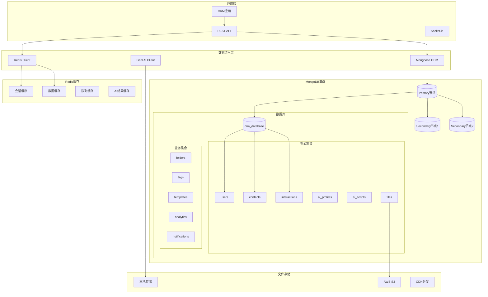

# Database Design - AI-Driven CRM System

## 数据库架构概览

### 技术选型
- **主数据库**: MongoDB 6.0+ (文档数据库)
- **缓存数据库**: Redis 7.0+ (内存数据库)
- **搜索引擎**: MongoDB Atlas Search (全文搜索)
- **文件存储**: GridFS / AWS S3 (文件存储)

### 数据库架构图



## 核心集合设计

### 1. Users Collection (用户集合)

```typescript
interface User {
  _id: ObjectId;
  email: string;                    // 邮箱地址（唯一）
  password: string;                 // 加密密码
  name: string;                     // 用户姓名
  avatar?: string;                  // 头像URL
  role: 'admin' | 'manager' | 'sales' | 'user'; // 用户角色
  
  // 个人信息
  profile: {
    phone?: string;                 // 电话号码
    department?: string;            // 部门
    position?: string;              // 职位
    location?: string;              // 地理位置
    timezone?: string;              // 时区
    language: string;               // 语言偏好
  };
  
  // 销售配置
  salesConfig: {
    methodology: SalesMethodology[];  // 偏好的销售方法论
    promptTemplates: {
      [key: string]: string;        // 自定义AI提示模板
    };
    defaultObjectives: string[];    // 默认沟通目标
    workingHours: {
      start: string;                // 工作开始时间
      end: string;                  // 工作结束时间
      timezone: string;             // 时区
      workdays: number[];           // 工作日 (0-6, 0=周日)
    };
  };
  
  // 系统设置
  settings: {
    notifications: {
      email: boolean;               // 邮件通知
      push: boolean;                // 推送通知
      sms: boolean;                 // 短信通知
    };
    privacy: {
      profileVisibility: 'public' | 'private' | 'team';
      dataSharing: boolean;         // 数据共享同意
    };
    ai: {
      autoAnalysis: boolean;        // 自动AI分析
      scriptGeneration: boolean;    // 自动话术生成
      profileUpdates: boolean;      // 自动画像更新
    };
  };
  
  // 统计信息
  stats: {
    totalContacts: number;          // 总联系人数
    totalInteractions: number;      // 总互动次数
    aiScriptsGenerated: number;     // AI话术生成次数
    lastActiveAt: Date;             // 最后活跃时间
    joinedAt: Date;                 // 加入时间
  };
  
  // 状态字段
  isActive: boolean;                // 账户状态
  isEmailVerified: boolean;         // 邮箱验证状态
  lastLoginAt?: Date;               // 最后登录时间
  passwordChangedAt?: Date;         // 密码修改时间
  
  // 时间戳
  createdAt: Date;
  updatedAt: Date;
}

// MongoDB Schema
const userSchema = new Schema<User>({
  email: { 
    type: String, 
    required: true, 
    unique: true, 
    lowercase: true,
    validate: [validator.isEmail, 'Invalid email format']
  },
  password: { 
    type: String, 
    required: true, 
    minlength: 8,
    select: false  // 默认不返回密码字段
  },
  name: { type: String, required: true, trim: true },
  avatar: { type: String },
  role: { 
    type: String, 
    enum: ['admin', 'manager', 'sales', 'user'], 
    default: 'user' 
  },
  
  profile: {
    phone: { type: String },
    department: { type: String },
    position: { type: String },
    location: { type: String },
    timezone: { type: String, default: 'Asia/Shanghai' },
    language: { type: String, default: 'zh-CN' }
  },
  
  salesConfig: {
    methodology: [{ 
      type: String, 
      enum: ['straight-line', 'sandler', 'obppc', 'consultative', 'challenger'] 
    }],
    promptTemplates: { type: Map, of: String },
    defaultObjectives: [String],
    workingHours: {
      start: { type: String, default: '09:00' },
      end: { type: String, default: '18:00' },
      timezone: { type: String, default: 'Asia/Shanghai' },
      workdays: [{ type: Number, min: 0, max: 6 }]
    }
  },
  
  settings: {
    notifications: {
      email: { type: Boolean, default: true },
      push: { type: Boolean, default: true },
      sms: { type: Boolean, default: false }
    },
    privacy: {
      profileVisibility: { 
        type: String, 
        enum: ['public', 'private', 'team'], 
        default: 'team' 
      },
      dataSharing: { type: Boolean, default: false }
    },
    ai: {
      autoAnalysis: { type: Boolean, default: true },
      scriptGeneration: { type: Boolean, default: true },
      profileUpdates: { type: Boolean, default: true }
    }
  },
  
  stats: {
    totalContacts: { type: Number, default: 0 },
    totalInteractions: { type: Number, default: 0 },
    aiScriptsGenerated: { type: Number, default: 0 },
    lastActiveAt: { type: Date, default: Date.now },
    joinedAt: { type: Date, default: Date.now }
  },
  
  isActive: { type: Boolean, default: true },
  isEmailVerified: { type: Boolean, default: false },
  lastLoginAt: { type: Date },
  passwordChangedAt: { type: Date }
}, {
  timestamps: true,
  toJSON: { virtuals: true },
  toObject: { virtuals: true }
});

// 索引
userSchema.index({ email: 1 }, { unique: true });
userSchema.index({ role: 1 });
userSchema.index({ 'stats.lastActiveAt': -1 });
userSchema.index({ createdAt: -1 });
```

### 2. Contacts Collection (联系人集合)

```typescript
interface Contact {
  _id: ObjectId;
  userId: ObjectId;                 // 所属用户ID
  
  // 基本信息
  name: string;                     // 姓名
  avatar?: string;                  // 头像URL
  photos: string[];                 // 相关照片（个人照片、合影等）
  
  // 联系方式
  phone?: string;                   // 电话
  email?: string;                   // 邮箱
  wechat?: string;                  // 微信号
  linkedin?: string;                // LinkedIn链接
  socialMedia: {
    platform: string;               // 平台名称
    handle: string;                 // 账号
    url?: string;                   // 链接
  }[];
  
  // 公司信息
  company?: {
    name: string;                   // 公司名称
    industry: string;               // 行业
    size?: string;                  // 公司规模
    website?: string;               // 公司网站
    address?: string;               // 公司地址
    description?: string;           // 公司描述
  };
  
  // 职业信息
  position?: string;                // 职位
  department?: string;              // 部门
  seniority: 'junior' | 'mid' | 'senior' | 'executive' | 'c-level'; // 职级
  
  // 个人信息
  personalInfo: {
    age?: number;                   // 年龄
    gender?: 'male' | 'female' | 'other'; // 性别
    location?: string;              // 地理位置
    education?: string;             // 教育背景
    interests: string[];            // 兴趣爱好
    personality?: string;           // 性格特征
  };
  
  // 分类和标签
  folder?: ObjectId;                // 所属文件夹
  tags: string[];                   // 自定义标签
  priority: 'high' | 'medium' | 'low'; // 优先级
  category: string;                 // 分类（行业、职级、年龄层等）
  
  // 销售信息
  salesInfo: {
    stage: 'prospect' | 'qualified' | 'proposal' | 'negotiation' | 'closed-won' | 'closed-lost';
    source: string;                 // 来源渠道
    assignedTo?: ObjectId;          // 分配给的销售人员
    lastContactDate?: Date;         // 最后联系日期
    nextFollowUp?: Date;            // 下次跟进时间
    dealValue?: number;             // 潜在交易价值
    probability?: number;           // 成交概率 (0-100)
    notes: string;                  // 销售备注
  };
  
  // AI相关
  aiProfileId?: ObjectId;           // AI画像ID
  lastAIAnalysis?: Date;            // 最后AI分析时间
  aiInsights: {
    communicationStyle?: string;    // 沟通风格
    decisionMakingStyle?: string;   // 决策风格
    painPoints: string[];           // 痛点
    motivations: string[];          // 动机
    objections: string[];           // 常见异议
  };
  
  // OCR数据（名片扫描）
  ocrData?: {
    originalImage: string;          // 原始图片URL
    extractedText: string;          // 提取的文本
    confidence: number;             // 识别置信度
    extractedAt: Date;              // 提取时间
    verified: boolean;              // 是否已验证
  };
  
  // 外部数据集成
  externalData: {
    tianyancha?: {
      companyId: string;            // 天眼查公司ID
      lastSync: Date;               // 最后同步时间
      data: any;                    // 天眼查数据
    };
    linkedin?: {
      profileId: string;            // LinkedIn档案ID
      lastSync: Date;               // 最后同步时间
      data: any;                    // LinkedIn数据
    };
  };
  
  // 统计信息
  stats: {
    totalInteractions: number;      // 总互动次数
    lastInteractionDate?: Date;     // 最后互动日期
    averageResponseTime?: number;   // 平均响应时间（小时）
    engagementScore: number;        // 参与度评分 (0-100)
    conversionProbability?: number; // 转化概率
  };
  
  // 状态字段
  isActive: boolean;                // 是否活跃
  isArchived: boolean;              // 是否归档
  
  // 时间戳
  createdAt: Date;
  updatedAt: Date;
}

// MongoDB Schema
const contactSchema = new Schema<Contact>({
  userId: { type: Schema.Types.ObjectId, ref: 'User', required: true },
  
  name: { type: String, required: true, trim: true },
  avatar: { type: String },
  photos: [String],
  
  phone: { type: String, trim: true },
  email: { 
    type: String, 
    lowercase: true,
    validate: [validator.isEmail, 'Invalid email format']
  },
  wechat: { type: String, trim: true },
  linkedin: { type: String, trim: true },
  socialMedia: [{
    platform: { type: String, required: true },
    handle: { type: String, required: true },
    url: { type: String }
  }],
  
  company: {
    name: { type: String, trim: true },
    industry: { type: String, trim: true },
    size: { type: String },
    website: { type: String },
    address: { type: String },
    description: { type: String }
  },
  
  position: { type: String, trim: true },
  department: { type: String, trim: true },
  seniority: { 
    type: String, 
    enum: ['junior', 'mid', 'senior', 'executive', 'c-level'],
    default: 'mid'
  },
  
  personalInfo: {
    age: { type: Number, min: 18, max: 100 },
    gender: { type: String, enum: ['male', 'female', 'other'] },
    location: { type: String },
    education: { type: String },
    interests: [String],
    personality: { type: String }
  },
  
  folder: { type: Schema.Types.ObjectId, ref: 'Folder' },
  tags: [String],
  priority: { 
    type: String, 
    enum: ['high', 'medium', 'low'], 
    default: 'medium' 
  },
  category: { type: String, trim: true },
  
  salesInfo: {
    stage: { 
      type: String, 
      enum: ['prospect', 'qualified', 'proposal', 'negotiation', 'closed-won', 'closed-lost'],
      default: 'prospect'
    },
    source: { type: String, trim: true },
    assignedTo: { type: Schema.Types.ObjectId, ref: 'User' },
    lastContactDate: { type: Date },
    nextFollowUp: { type: Date },
    dealValue: { type: Number, min: 0 },
    probability: { type: Number, min: 0, max: 100 },
    notes: { type: String }
  },
  
  aiProfileId: { type: Schema.Types.ObjectId, ref: 'AIProfile' },
  lastAIAnalysis: { type: Date },
  aiInsights: {
    communicationStyle: { type: String },
    decisionMakingStyle: { type: String },
    painPoints: [String],
    motivations: [String],
    objections: [String]
  },
  
  ocrData: {
    originalImage: { type: String },
    extractedText: { type: String },
    confidence: { type: Number, min: 0, max: 1 },
    extractedAt: { type: Date },
    verified: { type: Boolean, default: false }
  },
  
  externalData: {
    tianyancha: {
      companyId: { type: String },
      lastSync: { type: Date },
      data: { type: Schema.Types.Mixed }
    },
    linkedin: {
      profileId: { type: String },
      lastSync: { type: Date },
      data: { type: Schema.Types.Mixed }
    }
  },
  
  stats: {
    totalInteractions: { type: Number, default: 0 },
    lastInteractionDate: { type: Date },
    averageResponseTime: { type: Number },
    engagementScore: { type: Number, default: 0, min: 0, max: 100 },
    conversionProbability: { type: Number, min: 0, max: 100 }
  },
  
  isActive: { type: Boolean, default: true },
  isArchived: { type: Boolean, default: false }
}, {
  timestamps: true,
  toJSON: { virtuals: true },
  toObject: { virtuals: true }
});

// 索引
contactSchema.index({ userId: 1, name: 1 });
contactSchema.index({ userId: 1, 'company.name': 1 });
contactSchema.index({ userId: 1, tags: 1 });
contactSchema.index({ userId: 1, priority: 1 });
contactSchema.index({ userId: 1, 'salesInfo.stage': 1 });
contactSchema.index({ userId: 1, folder: 1 });
contactSchema.index({ email: 1 });
contactSchema.index({ phone: 1 });
contactSchema.index({ 'stats.lastInteractionDate': -1 });
contactSchema.index({ createdAt: -1 });
contactSchema.index({ updatedAt: -1 });

// 全文搜索索引
contactSchema.index({
  name: 'text',
  'company.name': 'text',
  position: 'text',
  tags: 'text'
});
```

### 3. Interactions Collection (互动记录集合)

```typescript
interface Interaction {
  _id: ObjectId;
  userId: ObjectId;                 // 所属用户ID
  contactId: ObjectId;              // 关联联系人ID
  
  // 基本信息
  type: 'call' | 'email' | 'meeting' | 'message' | 'social' | 'event' | 'other';
  subject?: string;                 // 主题
  content: string;                  // 内容
  summary?: string;                 // 摘要
  
  // 时间信息
  date: Date;                       // 互动日期
  duration?: number;                // 持续时间（分钟）
  
  // 媒体文件
  attachments: {
    type: 'image' | 'document' | 'audio' | 'video';
    url: string;                    // 文件URL
    filename: string;               // 文件名
    size: number;                   // 文件大小
    mimeType: string;               // MIME类型
  }[];
  
  // 位置信息
  location?: {
    name: string;                   // 地点名称
    address: string;                // 详细地址
    coordinates?: {
      latitude: number;
      longitude: number;
    };
  };
  
  // 参与者
  participants: {
    contactId?: ObjectId;           // 联系人ID
    name: string;                   // 姓名
    role?: string;                  // 角色
    email?: string;                 // 邮箱
  }[];
  
  // 互动结果
  outcome: {
    status: 'successful' | 'failed' | 'pending' | 'cancelled';
    nextSteps: string[];            // 下一步行动
    followUpDate?: Date;            // 跟进日期
    dealProgress?: {
      stage: string;                // 销售阶段
      probability: number;          // 成交概率变化
      value?: number;               // 交易价值
    };
  };
  
  // 话题和关键词
  topics: string[];                 // 讨论话题
  keywords: string[];               // 关键词
  sentiment: 'positive' | 'neutral' | 'negative'; // 情感倾向
  
  // AI分析
  aiAnalysis?: {
    summary: string;                // AI生成的摘要
    keyInsights: string[];          // 关键洞察
    actionItems: string[];          // 行动项
    riskFactors: string[];          // 风险因素
    opportunities: string[];        // 机会点
    nextBestAction: string;         // 下一步最佳行动
    confidence: number;             // 分析置信度
    analysisDate: Date;             // 分析时间
    model: string;                  // 使用的AI模型
  };
  
  // 销售方法论应用
  methodology?: {
    type: SalesMethodology;         // 使用的方法论
    stage: string;                  // 方法论阶段
    effectiveness: number;          // 效果评分 (1-10)
    notes: string;                  // 应用备注
  };
  
  // 元数据
  metadata: {
    source: string;                 // 数据来源
    channel: string;                // 沟通渠道
    platform?: string;             // 平台信息
    deviceType?: string;            // 设备类型
    ipAddress?: string;             // IP地址
    userAgent?: string;             // 用户代理
  };
  
  // 状态字段
  isImportant: boolean;             // 是否重要
  isPrivate: boolean;               // 是否私密
  isArchived: boolean;              // 是否归档
  
  // 时间戳
  createdAt: Date;
  updatedAt: Date;
}

// MongoDB Schema
const interactionSchema = new Schema<Interaction>({
  userId: { type: Schema.Types.ObjectId, ref: 'User', required: true },
  contactId: { type: Schema.Types.ObjectId, ref: 'Contact', required: true },
  
  type: { 
    type: String, 
    enum: ['call', 'email', 'meeting', 'message', 'social', 'event', 'other'],
    required: true 
  },
  subject: { type: String, trim: true },
  content: { type: String, required: true },
  summary: { type: String },
  
  date: { type: Date, required: true },
  duration: { type: Number, min: 0 },
  
  attachments: [{
    type: { 
      type: String, 
      enum: ['image', 'document', 'audio', 'video'],
      required: true 
    },
    url: { type: String, required: true },
    filename: { type: String, required: true },
    size: { type: Number, required: true },
    mimeType: { type: String, required: true }
  }],
  
  location: {
    name: { type: String },
    address: { type: String },
    coordinates: {
      latitude: { type: Number },
      longitude: { type: Number }
    }
  },
  
  participants: [{
    contactId: { type: Schema.Types.ObjectId, ref: 'Contact' },
    name: { type: String, required: true },
    role: { type: String },
    email: { type: String }
  }],
  
  outcome: {
    status: { 
      type: String, 
      enum: ['successful', 'failed', 'pending', 'cancelled'],
      default: 'pending'
    },
    nextSteps: [String],
    followUpDate: { type: Date },
    dealProgress: {
      stage: { type: String },
      probability: { type: Number, min: 0, max: 100 },
      value: { type: Number, min: 0 }
    }
  },
  
  topics: [String],
  keywords: [String],
  sentiment: { 
    type: String, 
    enum: ['positive', 'neutral', 'negative'],
    default: 'neutral'
  },
  
  aiAnalysis: {
    summary: { type: String },
    keyInsights: [String],
    actionItems: [String],
    riskFactors: [String],
    opportunities: [String],
    nextBestAction: { type: String },
    confidence: { type: Number, min: 0, max: 1 },
    analysisDate: { type: Date },
    model: { type: String }
  },
  
  methodology: {
    type: { 
      type: String, 
      enum: ['straight-line', 'sandler', 'obppc', 'consultative', 'challenger']
    },
    stage: { type: String },
    effectiveness: { type: Number, min: 1, max: 10 },
    notes: { type: String }
  },
  
  metadata: {
    source: { type: String, default: 'manual' },
    channel: { type: String },
    platform: { type: String },
    deviceType: { type: String },
    ipAddress: { type: String },
    userAgent: { type: String }
  },
  
  isImportant: { type: Boolean, default: false },
  isPrivate: { type: Boolean, default: false },
  isArchived: { type: Boolean, default: false }
}, {
  timestamps: true,
  toJSON: { virtuals: true },
  toObject: { virtuals: true }
});

// 索引
interactionSchema.index({ userId: 1, contactId: 1, date: -1 });
interactionSchema.index({ userId: 1, type: 1 });
interactionSchema.index({ userId: 1, date: -1 });
interactionSchema.index({ contactId: 1, date: -1 });
interactionSchema.index({ 'outcome.followUpDate': 1 });
interactionSchema.index({ topics: 1 });
interactionSchema.index({ keywords: 1 });
interactionSchema.index({ sentiment: 1 });
interactionSchema.index({ isImportant: 1 });
interactionSchema.index({ createdAt: -1 });

// 全文搜索索引
interactionSchema.index({
  subject: 'text',
  content: 'text',
  summary: 'text',
  topics: 'text',
  keywords: 'text'
});
```

### 4. AI Profiles Collection (AI画像集合)

```typescript
interface AIProfile {
  _id: ObjectId;
  userId: ObjectId;                 // 所属用户ID
  contactId: ObjectId;              // 关联联系人ID
  
  // 个性分析
  personality: {
    traits: {
      openness: number;             // 开放性 (0-100)
      conscientiousness: number;    // 尽责性 (0-100)
      extraversion: number;         // 外向性 (0-100)
      agreeableness: number;        // 宜人性 (0-100)
      neuroticism: number;          // 神经质 (0-100)
    };
    communicationStyle: {
      preferred: 'direct' | 'diplomatic' | 'analytical' | 'expressive';
      pace: 'fast' | 'moderate' | 'slow';
      formality: 'formal' | 'casual' | 'mixed';
      channelPreference: string[];  // 偏好的沟通渠道
    };
    decisionMaking: {
      style: 'analytical' | 'directive' | 'conceptual' | 'behavioral';
      speed: 'quick' | 'deliberate' | 'varies';
      factors: string[];            // 决策影响因素
      stakeholders: string[];       // 决策相关人员
    };
  };
  
  // 商业洞察
  businessInsights: {
    industry: {
      knowledge: number;            // 行业知识水平 (0-100)
      trends: string[];             // 关注的行业趋势
      challenges: string[];         // 行业挑战
      opportunities: string[];      // 行业机会
    };
    company: {
      role: string;                 // 在公司中的角色
      influence: number;            // 影响力 (0-100)
      budget: {
        authority: 'none' | 'limited' | 'significant' | 'full';
        range?: string;             // 预算范围
      };
      priorities: string[];         // 公司优先级
      painPoints: string[];         // 公司痛点
    };
    needs: {
      immediate: string[];          // 即时需求
      longTerm: string[];           // 长期需求
      budget: string;               // 预算情况
      timeline: string;             // 时间线
      criteria: string[];           // 决策标准
    };
  };
  
  // 关系洞察
  relationshipInsights: {
    rapport: {
      level: number;                // 关系亲密度 (0-100)
      buildingFactors: string[];    // 关系建立因素
      commonInterests: string[];    // 共同兴趣
      sharedExperiences: string[];  // 共同经历
    };
    trust: {
      level: number;                // 信任度 (0-100)
      indicators: string[];         // 信任指标
      concerns: string[];           // 信任顾虑
    };
    influence: {
      myInfluence: number;          // 我对他的影响力 (0-100)
      theirInfluence: number;       // 他对我的影响力 (0-100)
      keyInfluencers: string[];     // 关键影响者
    };
  };
  
  // 销售策略
  salesStrategy: {
    approach: {
      recommended: string;          // 推荐方法
      reasoning: string;            // 推荐理由
      alternatives: string[];       // 备选方案
    };
    messaging: {
      valueProposition: string;     // 价值主张
      keyMessages: string[];        // 关键信息
      avoidTopics: string[];        // 避免话题
    };
    timing: {
      bestTimes: string[];          // 最佳联系时间
      frequency: string;            // 联系频率
      seasonality: string;          // 季节性因素
    };
    objectionHandling: {
      likelyObjections: string[];   // 可能异议
      responses: {
        objection: string;
        response: string;
      }[];
    };
  };
  
  // 机会评估
  opportunityAssessment: {
    qualification: {
      budget: 'qualified' | 'unqualified' | 'unknown';
      authority: 'qualified' | 'unqualified' | 'unknown';
      need: 'qualified' | 'unqualified' | 'unknown';
      timeline: 'qualified' | 'unqualified' | 'unknown';
    };
    scoring: {
      overall: number;              // 总体评分 (0-100)
      potential: number;            // 潜力评分 (0-100)
      probability: number;          // 成交概率 (0-100)
      urgency: number;              // 紧急度 (0-100)
    };
    risks: {
      level: 'low' | 'medium' | 'high';
      factors: string[];            // 风险因素
      mitigation: string[];         // 缓解措施
    };
    timeline: {
      estimated: string;            // 预估时间线
      milestones: {
        stage: string;
        date: Date;
        probability: number;
      }[];
    };
  };
  
  // 分析元数据
  analysisMetadata: {
    confidence: number;             // 整体置信度 (0-1)
    dataQuality: {
      completeness: number;         // 数据完整性 (0-1)
      accuracy: number;             // 数据准确性 (0-1)
      freshness: number;            // 数据新鲜度 (0-1)
    };
    sources: {
      interactions: number;         // 分析的互动数量
      externalData: string[];       // 外部数据源
      manualInput: boolean;         // 是否包含手动输入
    };
    model: {
      name: string;                 // 使用的AI模型
      version: string;              // 模型版本
      parameters: any;              // 模型参数
    };
    performance: {
      accuracy: number;             // 预测准确性
      feedback: {
        positive: number;
        negative: number;
        neutral: number;
      };
    };
  };
  
  // 时间信息
  lastAnalyzedAt: Date;             // 最后分析时间
  nextAnalysisAt?: Date;            // 下次分析时间
  
  // 时间戳
  createdAt: Date;
  updatedAt: Date;
}

// MongoDB Schema
const aiProfileSchema = new Schema<AIProfile>({
  userId: { type: Schema.Types.ObjectId, ref: 'User', required: true },
  contactId: { type: Schema.Types.ObjectId, ref: 'Contact', required: true },
  
  personality: {
    traits: {
      openness: { type: Number, min: 0, max: 100 },
      conscientiousness: { type: Number, min: 0, max: 100 },
      extraversion: { type: Number, min: 0, max: 100 },
      agreeableness: { type: Number, min: 0, max: 100 },
      neuroticism: { type: Number, min: 0, max: 100 }
    },
    communicationStyle: {
      preferred: { 
        type: String, 
        enum: ['direct', 'diplomatic', 'analytical', 'expressive']
      },
      pace: { type: String, enum: ['fast', 'moderate', 'slow'] },
      formality: { type: String, enum: ['formal', 'casual', 'mixed'] },
      channelPreference: [String]
    },
    decisionMaking: {
      style: { 
        type: String, 
        enum: ['analytical', 'directive', 'conceptual', 'behavioral']
      },
      speed: { type: String, enum: ['quick', 'deliberate', 'varies'] },
      factors: [String],
      stakeholders: [String]
    }
  },
  
  businessInsights: {
    industry: {
      knowledge: { type: Number, min: 0, max: 100 },
      trends: [String],
      challenges: [String],
      opportunities: [String]
    },
    company: {
      role: { type: String },
      influence: { type: Number, min: 0, max: 100 },
      budget: {
        authority: { 
          type: String, 
          enum: ['none', 'limited', 'significant', 'full']
        },
        range: { type: String }
      },
      priorities: [String],
      painPoints: [String]
    },
    needs: {
      immediate: [String],
      longTerm: [String],
      budget: { type: String },
      timeline: { type: String },
      criteria: [String]
    }
  },
  
  relationshipInsights: {
    rapport: {
      level: { type: Number, min: 0, max: 100 },
      buildingFactors: [String],
      commonInterests: [String],
      sharedExperiences: [String]
    },
    trust: {
      level: { type: Number, min: 0, max: 100 },
      indicators: [String],
      concerns: [String]
    },
    influence: {
      myInfluence: { type: Number, min: 0, max: 100 },
      theirInfluence: { type: Number, min: 0, max: 100 },
      keyInfluencers: [String]
    }
  },
  
  salesStrategy: {
    approach: {
      recommended: { type: String },
      reasoning: { type: String },
      alternatives: [String]
    },
    messaging: {
      valueProposition: { type: String },
      keyMessages: [String],
      avoidTopics: [String]
    },
    timing: {
      bestTimes: [String],
      frequency: { type: String },
      seasonality: { type: String }
    },
    objectionHandling: {
      likelyObjections: [String],
      responses: [{
        objection: { type: String, required: true },
        response: { type: String, required: true }
      }]
    }
  },
  
  opportunityAssessment: {
    qualification: {
      budget: { type: String, enum: ['qualified', 'unqualified', 'unknown'] },
      authority: { type: String, enum: ['qualified', 'unqualified', 'unknown'] },
      need: { type: String, enum: ['qualified', 'unqualified', 'unknown'] },
      timeline: { type: String, enum: ['qualified', 'unqualified', 'unknown'] }
    },
    scoring: {
      overall: { type: Number, min: 0, max: 100 },
      potential: { type: Number, min: 0, max: 100 },
      probability: { type: Number, min: 0, max: 100 },
      urgency: { type: Number, min: 0, max: 100 }
    },
    risks: {
      level: { type: String, enum: ['low', 'medium', 'high'] },
      factors: [String],
      mitigation: [String]
    },
    timeline: {
      estimated: { type: String },
      milestones: [{
        stage: { type: String, required: true },
        date: { type: Date, required: true },
        probability: { type: Number, min: 0, max: 100 }
      }]
    }
  },
  
  analysisMetadata: {
    confidence: { type: Number, min: 0, max: 1 },
    dataQuality: {
      completeness: { type: Number, min: 0, max: 1 },
      accuracy: { type: Number, min: 0, max: 1 },
      freshness: { type: Number, min: 0, max: 1 }
    },
    sources: {
      interactions: { type: Number, default: 0 },
      externalData: [String],
      manualInput: { type: Boolean, default: false }
    },
    model: {
      name: { type: String },
      version: { type: String },
      parameters: { type: Schema.Types.Mixed }
    },
    performance: {
      accuracy: { type: Number, min: 0, max: 1 },
      feedback: {
        positive: { type: Number, default: 0 },
        negative: { type: Number, default: 0 },
        neutral: { type: Number, default: 0 }
      }
    }
  },
  
  lastAnalyzedAt: { type: Date, required: true },
  nextAnalysisAt: { type: Date }
}, {
  timestamps: true,
  toJSON: { virtuals: true },
  toObject: { virtuals: true }
});

// 索引
aiProfileSchema.index({ userId: 1, contactId: 1 }, { unique: true });
aiProfileSchema.index({ contactId: 1 });
aiProfileSchema.index({ lastAnalyzedAt: -1 });
aiProfileSchema.index({ 'opportunityAssessment.scoring.overall': -1 });
aiProfileSchema.index({ 'analysisMetadata.confidence': -1 });
```

### 5. AI Scripts Collection (AI话术集合)

```typescript
interface AIScript {
  _id: ObjectId;
  userId: ObjectId;                 // 所属用户ID
  contactId: ObjectId;              // 关联联系人ID
  
  // 基本信息
  title: string;                    // 话术标题
  methodology: SalesMethodology;    // 销售方法论
  objective: string;                // 沟通目标
  
  // 话术内容
  content: {
    opening: {
      text: string;                 // 开场白文本
      tone: string;                 // 语调建议
      keyPoints: string[];          // 关键要点
      timeEstimate: number;         // 预估时长（秒）
    };
    mainPoints: {
      sequence: number;             // 顺序
      title: string;                // 要点标题
      content: string;              // 要点内容
      supportingData?: string;      // 支撑数据
      transitionPhrase?: string;    // 过渡语句
      timeEstimate: number;         // 预估时长（秒）
    }[];
    objectionHandling: {
      objection: string;            // 异议内容
      response: string;             // 应对话术
      followUp?: string;            // 后续跟进
      confidence: number;           // 应对信心 (0-1)
    }[];
    closing: {
      text: string;                 // 收尾话术
      callToAction: string;         // 行动召唤
      alternatives: string[];       // 备选方案
      nextSteps: string[];          // 下一步行动
    };
    tips: {
      category: 'delivery' | 'timing' | 'body-language' | 'follow-up';
      content: string;              // 建议内容
      importance: 'high' | 'medium' | 'low';
    }[];
  };
  
  // 上下文信息
  context: {
    contactProfile: {
      name: string;
      company?: string;
      position?: string;
      industry?: string;
      personalityType?: string;
    };
    conversationHistory: {
      lastInteraction?: Date;
      topics: string[];
      sentiment: string;
      outcomes: string[];
    };
    businessContext: {
      dealStage: string;
      dealValue?: number;
      competition?: string[];
      urgency: 'low' | 'medium' | 'high';
    };
    constraints: {
      timeLimit?: number;           // 时间限制（分钟）
      channel: string;              // 沟通渠道
      setting: string;              // 沟通环境
      participants?: string[];      // 参与者
    };
  };
  
  // 个性化元素
  personalization: {
    references: {
      type: 'personal' | 'business' | 'industry' | 'mutual';
      content: string;              // 引用内容
      context: string;              // 引用背景
    }[];
    customizations: {
      field: string;                // 自定义字段
      value: string;                // 自定义值
      reasoning: string;            // 自定义理由
    }[];
  };
  
  // 生成元数据
  generation: {
    model: string;                  // 使用的AI模型
    version: string;                // 模型版本
    prompt: string;                 // 使用的提示词
    parameters: {
      temperature: number;
      maxTokens: number;
      topP?: number;
      frequencyPenalty?: number;
    };
    tokens: {
      input: number;                // 输入token数
      output: number;               // 输出token数
      total: number;                // 总token数
    };
    generatedAt: Date;              // 生成时间
    duration: number;               // 生成耗时（毫秒）
  };
  
  // 使用和反馈
  usage: {
    timesUsed: number;              // 使用次数
    lastUsedAt?: Date;              // 最后使用时间
    effectiveness: {
      rating: number;               // 效果评分 (1-10)
      feedback: string;             // 反馈内容
      outcome: 'successful' | 'failed' | 'partial';
      ratedAt: Date;                // 评分时间
    }[];
    modifications: {
      field: string;                // 修改字段
      originalValue: string;        // 原始值
      newValue: string;             // 新值
      reason: string;               // 修改原因
      modifiedAt: Date;             // 修改时间
    }[];
  };
  
  // 版本控制
  version: {
    major: number;                  // 主版本号
    minor: number;                  // 次版本号
    patch: number;                  // 补丁版本号
    changelog: string;              // 变更日志
  };
  
  // 状态字段
  status: 'draft' | 'active' | 'archived' | 'deprecated';
  isTemplate: boolean;              // 是否为模板
  isShared: boolean;                // 是否共享
  
  // 时间戳
  createdAt: Date;
  updatedAt: Date;
}

// MongoDB Schema
const aiScriptSchema = new Schema<AIScript>({
  userId: { type: Schema.Types.ObjectId, ref: 'User', required: true },
  contactId: { type: Schema.Types.ObjectId, ref: 'Contact', required: true },
  
  title: { type: String, required: true, trim: true },
  methodology: { 
    type: String, 
    enum: ['straight-line', 'sandler', 'obppc', 'consultative', 'challenger'],
    required: true 
  },
  objective: { type: String, required: true },
  
  content: {
    opening: {
      text: { type: String, required: true },
      tone: { type: String },
      keyPoints: [String],
      timeEstimate: { type: Number, default: 60 }
    },
    mainPoints: [{
      sequence: { type: Number, required: true },
      title: { type: String, required: true },
      content: { type: String, required: true },
      supportingData: { type: String },
      transitionPhrase: { type: String },
      timeEstimate: { type: Number, default: 120 }
    }],
    objectionHandling: [{
      objection: { type: String, required: true },
      response: { type: String, required: true },
      followUp: { type: String },
      confidence: { type: Number, min: 0, max: 1 }
    }],
    closing: {
      text: { type: String, required: true },
      callToAction: { type: String, required: true },
      alternatives: [String],
      nextSteps: [String]
    },
    tips: [{
      category: { 
        type: String, 
        enum: ['delivery', 'timing', 'body-language', 'follow-up'],
        required: true 
      },
      content: { type: String, required: true },
      importance: { 
        type: String, 
        enum: ['high', 'medium', 'low'],
        default: 'medium'
      }
    }]
  },
  
  context: {
    contactProfile: {
      name: { type: String, required: true },
      company: { type: String },
      position: { type: String },
      industry: { type: String },
      personalityType: { type: String }
    },
    conversationHistory: {
      lastInteraction: { type: Date },
      topics: [String],
      sentiment: { type: String },
      outcomes: [String]
    },
    businessContext: {
      dealStage: { type: String },
      dealValue: { type: Number },
      competition: [String],
      urgency: { type: String, enum: ['low', 'medium', 'high'] }
    },
    constraints: {
      timeLimit: { type: Number },
      channel: { type: String },
      setting: { type: String },
      participants: [String]
    }
  },
  
  personalization: {
    references: [{
      type: { 
        type: String, 
        enum: ['personal', 'business', 'industry', 'mutual'],
        required: true 
      },
      content: { type: String, required: true },
      context: { type: String, required: true }
    }],
    customizations: [{
      field: { type: String, required: true },
      value: { type: String, required: true },
      reasoning: { type: String, required: true }
    }]
  },
  
  generation: {
    model: { type: String, required: true },
    version: { type: String, required: true },
    prompt: { type: String, required: true },
    parameters: {
      temperature: { type: Number, required: true },
      maxTokens: { type: Number, required: true },
      topP: { type: Number },
      frequencyPenalty: { type: Number }
    },
    tokens: {
      input: { type: Number, required: true },
      output: { type: Number, required: true },
      total: { type: Number, required: true }
    },
    generatedAt: { type: Date, required: true },
    duration: { type: Number, required: true }
  },
  
  usage: {
    timesUsed: { type: Number, default: 0 },
    lastUsedAt: { type: Date },
    effectiveness: [{
      rating: { type: Number, min: 1, max: 10, required: true },
      feedback: { type: String },
      outcome: { 
        type: String, 
        enum: ['successful', 'failed', 'partial'],
        required: true 
      },
      ratedAt: { type: Date, required: true }
    }],
    modifications: [{
      field: { type: String, required: true },
      originalValue: { type: String, required: true },
      newValue: { type: String, required: true },
      reason: { type: String, required: true },
      modifiedAt: { type: Date, required: true }
    }]
  },
  
  version: {
    major: { type: Number, default: 1 },
    minor: { type: Number, default: 0 },
    patch: { type: Number, default: 0 },
    changelog: { type: String }
  },
  
  status: { 
    type: String, 
    enum: ['draft', 'active', 'archived', 'deprecated'],
    default: 'active'
  },
  isTemplate: { type: Boolean, default: false },
  isShared: { type: Boolean, default: false }
}, {
  timestamps: true,
  toJSON: { virtuals: true },
  toObject: { virtuals: true }
});

// 索引
aiScriptSchema.index({ userId: 1, contactId: 1 });
aiScriptSchema.index({ userId: 1, methodology: 1 });
aiScriptSchema.index({ userId: 1, status: 1 });
aiScriptSchema.index({ contactId: 1, createdAt: -1 });
aiScriptSchema.index({ 'generation.generatedAt': -1 });
aiScriptSchema.index({ 'usage.timesUsed': -1 });
aiScriptSchema.index({ isTemplate: 1 });
aiScriptSchema.index({ isShared: 1 });

// 全文搜索索引
aiScriptSchema.index({
  title: 'text',
  objective: 'text',
  'content.opening.text': 'text',
  'content.mainPoints.content': 'text'
});
```

## Redis缓存设计

### 缓存策略

```typescript
// Redis键命名规范
const CACHE_KEYS = {
  // 用户会话
  USER_SESSION: (userId: string) => `session:user:${userId}`,
  USER_PERMISSIONS: (userId: string) => `permissions:user:${userId}`,
  
  // 联系人缓存
  CONTACT_DETAIL: (contactId: string) => `contact:detail:${contactId}`,
  CONTACT_LIST: (userId: string, filters: string) => `contact:list:${userId}:${filters}`,
  CONTACT_SEARCH: (userId: string, query: string) => `contact:search:${userId}:${query}`,
  
  // AI分析结果缓存
  AI_PROFILE: (contactId: string) => `ai:profile:${contactId}`,
  AI_SCRIPT: (scriptId: string) => `ai:script:${scriptId}`,
  AI_RECOMMENDATIONS: (contactId: string) => `ai:recommendations:${contactId}`,
  
  // 互动记录缓存
  INTERACTION_TIMELINE: (contactId: string) => `interaction:timeline:${contactId}`,
  INTERACTION_STATS: (userId: string) => `interaction:stats:${userId}`,
  
  // 任务队列
  AI_ANALYSIS_QUEUE: 'queue:ai:analysis',
  EMAIL_QUEUE: 'queue:email',
  NOTIFICATION_QUEUE: 'queue:notification',
  
  // 速率限制
  RATE_LIMIT: (ip: string, endpoint: string) => `rate_limit:${ip}:${endpoint}`,
  API_USAGE: (userId: string, date: string) => `api_usage:${userId}:${date}`,
  
  // 实时数据
  ONLINE_USERS: 'online:users',
  ACTIVE_SESSIONS: 'active:sessions',
  SOCKET_ROOMS: (roomId: string) => `socket:room:${roomId}`
};

// 缓存TTL配置
const CACHE_TTL = {
  USER_SESSION: 7 * 24 * 60 * 60,      // 7天
  USER_PERMISSIONS: 1 * 60 * 60,       // 1小时
  CONTACT_DETAIL: 30 * 60,             // 30分钟
  CONTACT_LIST: 10 * 60,               // 10分钟
  AI_PROFILE: 2 * 60 * 60,             // 2小时
  AI_SCRIPT: 1 * 60 * 60,              // 1小时
  INTERACTION_TIMELINE: 15 * 60,       // 15分钟
  RATE_LIMIT: 15 * 60,                 // 15分钟
  ONLINE_USERS: 5 * 60                 // 5分钟
};
```

## 数据库优化策略

### 1. 索引优化

```javascript
// 复合索引策略
db.contacts.createIndex(
  { "userId": 1, "salesInfo.stage": 1, "priority": 1, "updatedAt": -1 },
  { name: "idx_user_sales_priority_updated" }
);

db.interactions.createIndex(
  { "userId": 1, "contactId": 1, "date": -1 },
  { name: "idx_user_contact_date" }
);

db.ai_profiles.createIndex(
  { "contactId": 1, "lastAnalyzedAt": -1 },
  { name: "idx_contact_analysis_date" }
);

// 稀疏索引（针对可选字段）
db.contacts.createIndex(
  { "email": 1 },
  { sparse: true, name: "idx_contact_email_sparse" }
);

db.contacts.createIndex(
  { "phone": 1 },
  { sparse: true, name: "idx_contact_phone_sparse" }
);

// 部分索引（针对活跃数据）
db.contacts.createIndex(
  { "userId": 1, "updatedAt": -1 },
  { 
    partialFilterExpression: { "isActive": true, "isArchived": false },
    name: "idx_active_contacts"
  }
);

// TTL索引（自动清理过期数据）
db.sessions.createIndex(
  { "expiresAt": 1 },
  { expireAfterSeconds: 0, name: "idx_session_ttl" }
);

db.notifications.createIndex(
  { "createdAt": 1 },
  { expireAfterSeconds: 30 * 24 * 60 * 60, name: "idx_notification_ttl" } // 30天后自动删除
);
```

### 2. 查询优化

```javascript
// 聚合管道优化示例

// 联系人统计查询
const getContactStats = async (userId) => {
  return await Contact.aggregate([
    { $match: { userId: new ObjectId(userId), isActive: true } },
    {
      $group: {
        _id: null,
        totalContacts: { $sum: 1 },
        highPriority: {
          $sum: { $cond: [{ $eq: ["$priority", "high"] }, 1, 0] }
        },
        byStage: {
          $push: {
            stage: "$salesInfo.stage",
            count: 1
          }
        },
        avgEngagement: { $avg: "$stats.engagementScore" }
      }
    },
    {
      $project: {
        _id: 0,
        totalContacts: 1,
        highPriority: 1,
        avgEngagement: { $round: ["$avgEngagement", 2] },
        stageDistribution: {
          $arrayToObject: {
            $map: {
              input: "$byStage",
              as: "item",
              in: {
                k: "$$item.stage",
                v: "$$item.count"
              }
            }
          }
        }
      }
    }
  ]);
};

// 互动历史查询（分页优化）
const getInteractionHistory = async (contactId, page = 1, limit = 20) => {
  const skip = (page - 1) * limit;
  
  return await Interaction.aggregate([
    { $match: { contactId: new ObjectId(contactId) } },
    { $sort: { date: -1 } },
    { $skip: skip },
    { $limit: limit },
    {
      $lookup: {
        from: "users",
        localField: "userId",
        foreignField: "_id",
        as: "user",
        pipeline: [{ $project: { name: 1, avatar: 1 } }]
      }
    },
    { $unwind: "$user" },
    {
      $project: {
        type: 1,
        subject: 1,
        content: 1,
        date: 1,
        sentiment: 1,
        "user.name": 1,
        "user.avatar": 1,
        "aiAnalysis.summary": 1,
        "outcome.nextSteps": 1
      }
    }
  ]);
};
```

### 3. 数据分片策略

```javascript
// 分片键设计
// 基于用户ID进行分片，确保单个用户的数据在同一分片
sh.shardCollection("crm.contacts", { "userId": 1, "_id": 1 });
sh.shardCollection("crm.interactions", { "userId": 1, "date": 1 });
sh.shardCollection("crm.ai_profiles", { "userId": 1, "_id": 1 });
sh.shardCollection("crm.ai_scripts", { "userId": 1, "_id": 1 });

// 分片标签设置
sh.addShardTag("shard0000", "hot");  // 热数据分片
sh.addShardTag("shard0001", "warm"); // 温数据分片
sh.addShardTag("shard0002", "cold"); // 冷数据分片

// 基于数据热度的标签规则
sh.addTagRange(
  "crm.interactions",
  { "userId": MinKey, "date": new Date("2024-01-01") },
  { "userId": MaxKey, "date": new Date("2024-12-31") },
  "hot"
);
```

## 数据迁移和版本控制

### 1. 数据迁移脚本

```javascript
// migrations/001_initial_schema.js
module.exports = {
  up: async (db) => {
    // 创建集合和索引
    await db.createCollection('users');
    await db.createCollection('contacts');
    await db.createCollection('interactions');
    await db.createCollection('ai_profiles');
    await db.createCollection('ai_scripts');
    
    // 创建基础索引
    await db.collection('users').createIndex({ email: 1 }, { unique: true });
    await db.collection('contacts').createIndex({ userId: 1, name: 1 });
    await db.collection('interactions').createIndex({ userId: 1, contactId: 1, date: -1 });
  },
  
  down: async (db) => {
    // 回滚操作
    await db.collection('users').drop();
    await db.collection('contacts').drop();
    await db.collection('interactions').drop();
    await db.collection('ai_profiles').drop();
    await db.collection('ai_scripts').drop();
  }
};

// migrations/002_add_ai_features.js
module.exports = {
  up: async (db) => {
    // 为现有联系人添加AI相关字段
    await db.collection('contacts').updateMany(
      {},
      {
        $set: {
          aiInsights: {
            communicationStyle: null,
            decisionMakingStyle: null,
            painPoints: [],
            motivations: [],
            objections: []
          },
          lastAIAnalysis: null
        }
      }
    );
    
    // 创建AI相关索引
    await db.collection('contacts').createIndex({ lastAIAnalysis: -1 });
    await db.collection('ai_profiles').createIndex({ contactId: 1 }, { unique: true });
  },
  
  down: async (db) => {
    // 移除AI相关字段
    await db.collection('contacts').updateMany(
      {},
      {
        $unset: {
          aiInsights: "",
          lastAIAnalysis: ""
        }
      }
    );
  }
};
```

### 2. 数据验证规则

```javascript
// 数据验证Schema
const contactValidationSchema = {
  $jsonSchema: {
    bsonType: "object",
    required: ["userId", "name"],
    properties: {
      userId: {
        bsonType: "objectId",
        description: "用户ID必须是有效的ObjectId"
      },
      name: {
        bsonType: "string",
        minLength: 1,
        maxLength: 100,
        description: "姓名必须是1-100字符的字符串"
      },
      email: {
        bsonType: ["string", "null"],
        pattern: "^[a-zA-Z0-9._%+-]+@[a-zA-Z0-9.-]+\\.[a-zA-Z]{2,}$",
        description: "邮箱格式必须有效"
      },
      priority: {
        enum: ["high", "medium", "low"],
        description: "优先级必须是指定值之一"
      },
      "salesInfo.stage": {
        enum: ["prospect", "qualified", "proposal", "negotiation", "closed-won", "closed-lost"],
        description: "销售阶段必须是指定值之一"
      }
    }
  }
};

// 应用验证规则
db.runCommand({
  collMod: "contacts",
  validator: contactValidationSchema,
  validationLevel: "strict",
  validationAction: "error"
});
```

## 备份和恢复策略

### 1. 备份策略

```bash
#!/bin/bash
# backup_script.sh

# 配置变量
DATE=$(date +"%Y%m%d_%H%M%S")
BACKUP_DIR="/backup/mongodb"
DB_NAME="crm_database"
S3_BUCKET="crm-backups"

# 创建备份目录
mkdir -p $BACKUP_DIR/$DATE

# 执行备份
mongodump --host localhost:27017 --db $DB_NAME --out $BACKUP_DIR/$DATE

# 压缩备份文件
tar -czf $BACKUP_DIR/crm_backup_$DATE.tar.gz -C $BACKUP_DIR/$DATE .

# 上传到S3
aws s3 cp $BACKUP_DIR/crm_backup_$DATE.tar.gz s3://$S3_BUCKET/

# 清理本地备份（保留7天）
find $BACKUP_DIR -name "*.tar.gz" -mtime +7 -delete

# 验证备份完整性
mongorestore --host localhost:27017 --db ${DB_NAME}_test --drop $BACKUP_DIR/$DATE/$DB_NAME

echo "备份完成: crm_backup_$DATE.tar.gz"
```

### 2. 恢复策略

```bash
#!/bin/bash
# restore_script.sh

BACKUP_FILE=$1
TARGET_DB=${2:-crm_database}

if [ -z "$BACKUP_FILE" ]; then
    echo "使用方法: $0 <backup_file> [target_db]"
    exit 1
fi

# 解压备份文件
tar -xzf $BACKUP_FILE -C /tmp/restore/

# 执行恢复
mongorestore --host localhost:27017 --db $TARGET_DB --drop /tmp/restore/

# 清理临时文件
rm -rf /tmp/restore/

echo "恢复完成到数据库: $TARGET_DB"
```

## 监控和性能调优

### 1. 性能监控指标

```javascript
// 性能监控查询
const getPerformanceMetrics = async () => {
  const db = mongoose.connection.db;
  
  // 数据库统计
  const dbStats = await db.stats();
  
  // 集合统计
  const collections = ['users', 'contacts', 'interactions', 'ai_profiles'];
  const collectionStats = {};
  
  for (const collection of collections) {
    collectionStats[collection] = await db.collection(collection).stats();
  }
  
  // 索引使用统计
  const indexStats = await db.collection('contacts').aggregate([
    { $indexStats: {} }
  ]).toArray();
  
  // 慢查询统计
  const slowQueries = await db.admin().command({
    getLog: 'global'
  });
  
  return {
    database: {
      size: dbStats.dataSize,
      indexSize: dbStats.indexSize,
      collections: dbStats.collections,
      objects: dbStats.objects
    },
    collections: collectionStats,
    indexes: indexStats,
    slowQueries: slowQueries.log.filter(log => 
      log.includes('SLOW') && log.includes('ms')
    ).slice(-10)
  };
};
```

### 2. 查询优化建议

```javascript
// 查询性能分析
const analyzeQuery = async (collection, query) => {
  const explanation = await db.collection(collection)
    .find(query)
    .explain('executionStats');
    
  return {
    executionTime: explanation.executionStats.executionTimeMillis,
    documentsExamined: explanation.executionStats.totalDocsExamined,
    documentsReturned: explanation.executionStats.totalDocsReturned,
    indexUsed: explanation.executionStats.executionStages.indexName || 'COLLSCAN',
    efficiency: explanation.executionStats.totalDocsReturned / 
                explanation.executionStats.totalDocsExamined
  };
};

// 自动优化建议
const getOptimizationSuggestions = (analysisResult) => {
  const suggestions = [];
  
  if (analysisResult.efficiency < 0.1) {
    suggestions.push('考虑添加复合索引以提高查询效率');
  }
  
  if (analysisResult.executionTime > 100) {
    suggestions.push('查询执行时间过长，建议优化查询条件或添加索引');
  }
  
  if (analysisResult.indexUsed === 'COLLSCAN') {
    suggestions.push('查询未使用索引，建议创建适当的索引');
  }
  
  return suggestions;
};
```

## 数据安全和合规

### 1. 数据加密

```javascript
// 字段级加密配置
const encryptionSchema = {
  "encryptMetadata": {
    "keyId": [UUID("12345678-1234-1234-1234-123456789012")]
  },
  "properties": {
    "phone": {
      "encrypt": {
        "bsonType": "string",
        "algorithm": "AEAD_AES_256_CBC_HMAC_SHA_512-Deterministic"
      }
    },
    "email": {
      "encrypt": {
        "bsonType": "string",
        "algorithm": "AEAD_AES_256_CBC_HMAC_SHA_512-Deterministic"
      }
    },
    "personalInfo": {
      "encrypt": {
        "bsonType": "object",
        "algorithm": "AEAD_AES_256_CBC_HMAC_SHA_512-Random"
      }
    }
  }
};
```

### 2. 审计日志

```javascript
// 审计日志Schema
const auditLogSchema = new Schema({
  userId: { type: Schema.Types.ObjectId, ref: 'User', required: true },
  action: { 
    type: String, 
    enum: ['create', 'read', 'update', 'delete', 'export', 'import'],
    required: true 
  },
  resource: {
    type: { type: String, required: true }, // 'contact', 'interaction', etc.
    id: { type: Schema.Types.ObjectId, required: true }
  },
  changes: {
    before: { type: Schema.Types.Mixed },
    after: { type: Schema.Types.Mixed }
  },
  metadata: {
    ip: String,
    userAgent: String,
    timestamp: { type: Date, default: Date.now },
    sessionId: String
  }
}, {
  timestamps: true,
  capped: { size: 100000000, max: 1000000 } // 限制集合大小
});

// 自动审计中间件
const auditMiddleware = function(next) {
  if (this.isModified()) {
    const changes = this.getChanges();
    AuditLog.create({
      userId: this.userId,
      action: this.isNew ? 'create' : 'update',
      resource: {
        type: this.constructor.modelName.toLowerCase(),
        id: this._id
      },
      changes: {
        before: this._original,
        after: changes
      },
      metadata: {
        ip: this._req?.ip,
        userAgent: this._req?.get('User-Agent'),
        sessionId: this._req?.sessionID
      }
    });
  }
  next();
};

// 应用到所有模型
contactSchema.pre('save', auditMiddleware);
interactionSchema.pre('save', auditMiddleware);
```

---

## 总结

本数据库设计文档详细定义了AI驱动CRM系统的完整数据架构，包括：

1. **核心集合设计**: Users、Contacts、Interactions、AI Profiles、AI Scripts
2. **索引优化策略**: 复合索引、稀疏索引、部分索引、TTL索引
3. **缓存设计**: Redis缓存策略和键命名规范
4. **性能优化**: 查询优化、分片策略、聚合管道优化
5. **数据管理**: 迁移脚本、验证规则、备份恢复
6. **监控调优**: 性能指标监控、查询分析、优化建议
7. **安全合规**: 数据加密、审计日志、访问控制

该设计支持系统的核心功能需求，包括联系人管理、AI画像分析、销售话术生成、互动历史追踪等，同时确保了系统的可扩展性、性能和安全性。