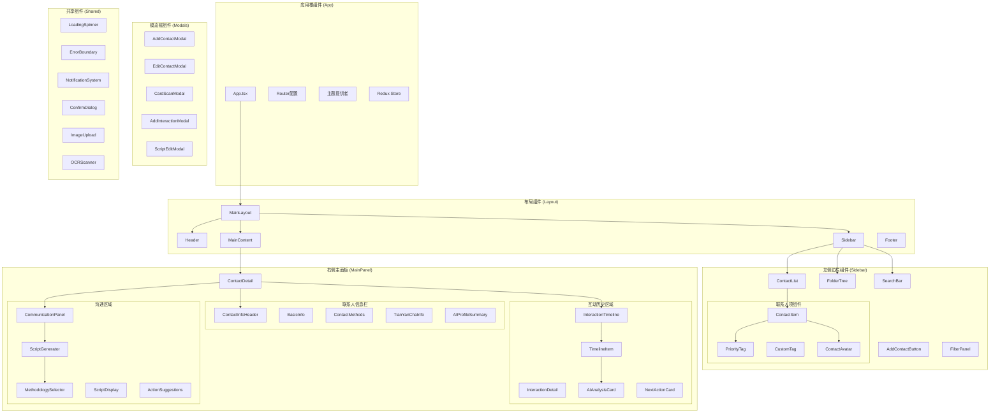
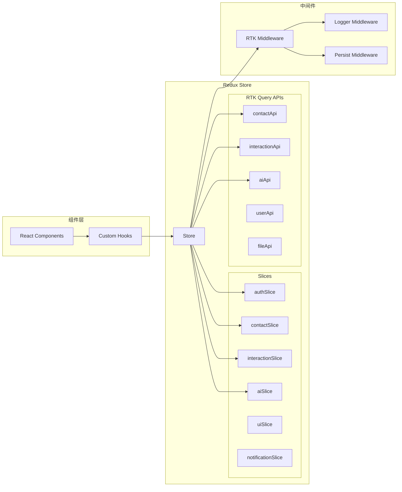

# Frontend Architecture - AI-Driven CRM System

## 前端架构概览

### 技术栈
- **React 18**: 现代化UI框架，支持并发特性
- **TypeScript**: 类型安全的JavaScript开发
- **Material-UI (MUI)**: 企业级React组件库
- **Redux Toolkit**: 状态管理和数据流
- **React Router**: 客户端路由
- **React DnD**: 拖拽功能实现
- **Socket.io Client**: 实时通信
- **Axios**: HTTP客户端

## 组件架构图



## 状态管理架构



## 详细组件规范

### 1. 左侧边栏组件

#### ContactList 组件
```typescript
interface ContactListProps {
  contacts: Contact[];
  selectedContactId?: string;
  onContactSelect: (contact: Contact) => void;
  onContactDrag: (draggedContact: Contact, targetFolder: string) => void;
  loading?: boolean;
}

const ContactList: React.FC<ContactListProps> = ({
  contacts,
  selectedContactId,
  onContactSelect,
  onContactDrag,
  loading = false
}) => {
  // 拖拽逻辑
  const [{ isDragging }, drag] = useDrag({
    type: 'contact',
    item: { contact },
    collect: (monitor) => ({
      isDragging: monitor.isDragging()
    })
  });

  // 虚拟化长列表
  const { virtualItems, totalSize } = useVirtualizer({
    count: contacts.length,
    getScrollElement: () => parentRef.current,
    estimateSize: () => 80
  });

  return (
    <Box sx={{ height: '100%', overflow: 'auto' }}>
      {loading ? (
        <ContactListSkeleton />
      ) : (
        <List>
          {virtualItems.map((virtualItem) => {
            const contact = contacts[virtualItem.index];
            return (
              <ContactItem
                key={contact.id}
                contact={contact}
                selected={contact.id === selectedContactId}
                onSelect={onContactSelect}
                onDrag={onContactDrag}
                style={{
                  position: 'absolute',
                  top: 0,
                  left: 0,
                  width: '100%',
                  height: `${virtualItem.size}px`,
                  transform: `translateY(${virtualItem.start}px)`
                }}
              />
            );
          })}
        </List>
      )}
    </Box>
  );
};
```

#### FolderTree 组件
```typescript
interface FolderTreeProps {
  folders: FolderStructure;
  selectedFolder?: string;
  onFolderSelect: (folderId: string) => void;
  onFolderCreate: (parentId: string, name: string) => void;
  onFolderRename: (folderId: string, newName: string) => void;
  onFolderDelete: (folderId: string) => void;
}

const FolderTree: React.FC<FolderTreeProps> = ({
  folders,
  selectedFolder,
  onFolderSelect,
  onFolderCreate,
  onFolderRename,
  onFolderDelete
}) => {
  const [expandedFolders, setExpandedFolders] = useState<Set<string>>(new Set());
  const [editingFolder, setEditingFolder] = useState<string | null>(null);

  // 拖拽目标区域
  const [{ isOver }, drop] = useDrop({
    accept: 'contact',
    drop: (item: { contact: Contact }) => {
      // 处理联系人拖拽到文件夹
      onContactMove(item.contact, selectedFolder);
    },
    collect: (monitor) => ({
      isOver: monitor.isOver()
    })
  });

  const renderFolder = (folder: Folder, level: number = 0) => (
    <TreeItem
      key={folder.id}
      nodeId={folder.id}
      label={
        <FolderLabel
          folder={folder}
          selected={folder.id === selectedFolder}
          editing={editingFolder === folder.id}
          onEdit={setEditingFolder}
          onRename={onFolderRename}
          onDelete={onFolderDelete}
          level={level}
        />
      }
      onClick={() => onFolderSelect(folder.id)}
    >
      {folder.children?.map(child => renderFolder(child, level + 1))}
    </TreeItem>
  );

  return (
    <Box ref={drop} sx={{ bgcolor: isOver ? 'action.hover' : 'transparent' }}>
      <TreeView
        expanded={Array.from(expandedFolders)}
        onNodeToggle={(event, nodeIds) => setExpandedFolders(new Set(nodeIds))}
        defaultCollapseIcon={<ExpandMoreIcon />}
        defaultExpandIcon={<ChevronRightIcon />}
      >
        {folders.map(folder => renderFolder(folder))}
      </TreeView>
    </Box>
  );
};
```

### 2. 右侧主面板组件

#### ContactDetail 组件
```typescript
interface ContactDetailProps {
  contact: Contact | null;
  interactions: Interaction[];
  aiProfile: AIProfile | null;
  loading?: boolean;
}

const ContactDetail: React.FC<ContactDetailProps> = ({
  contact,
  interactions,
  aiProfile,
  loading = false
}) => {
  const [activeTab, setActiveTab] = useState(0);
  const [scriptGenerating, setScriptGenerating] = useState(false);

  if (!contact) {
    return <EmptyState message="请选择一个联系人查看详情" />;
  }

  if (loading) {
    return <ContactDetailSkeleton />;
  }

  return (
    <Box sx={{ height: '100%', display: 'flex', flexDirection: 'column' }}>
      {/* 联系人信息栏 */}
      <ContactInfoHeader
        contact={contact}
        aiProfile={aiProfile}
        onEdit={() => setEditModalOpen(true)}
        onRefreshProfile={() => refreshAIProfile(contact.id)}
      />

      {/* 标签页 */}
      <Tabs value={activeTab} onChange={(e, newValue) => setActiveTab(newValue)}>
        <Tab label="互动历史" />
        <Tab label="AI分析" />
        <Tab label="销售机会" />
      </Tabs>

      {/* 内容区域 */}
      <Box sx={{ flex: 1, overflow: 'hidden' }}>
        <TabPanel value={activeTab} index={0}>
          <InteractionTimeline
            interactions={interactions}
            onAddInteraction={() => setAddInteractionModalOpen(true)}
            onEditInteraction={handleEditInteraction}
          />
        </TabPanel>
        
        <TabPanel value={activeTab} index={1}>
          <AIAnalysisPanel
            contact={contact}
            aiProfile={aiProfile}
            onRegenerateProfile={() => regenerateAIProfile(contact.id)}
          />
        </TabPanel>
        
        <TabPanel value={activeTab} index={2}>
          <OpportunityPanel
            contact={contact}
            interactions={interactions}
            onUpdateOpportunity={handleUpdateOpportunity}
          />
        </TabPanel>
      </Box>

      {/* 沟通区域 */}
      <CommunicationPanel
        contact={contact}
        aiProfile={aiProfile}
        onGenerateScript={handleGenerateScript}
        scriptGenerating={scriptGenerating}
      />
    </Box>
  );
};
```

#### ScriptGenerator 组件
```typescript
interface ScriptGeneratorProps {
  contact: Contact;
  aiProfile: AIProfile | null;
  onGenerate: (context: ScriptContext) => Promise<SalesScript>;
  loading?: boolean;
}

const ScriptGenerator: React.FC<ScriptGeneratorProps> = ({
  contact,
  aiProfile,
  onGenerate,
  loading = false
}) => {
  const [methodology, setMethodology] = useState<SalesMethodology>('straight-line');
  const [objective, setObjective] = useState('');
  const [timeConstraint, setTimeConstraint] = useState<number>(15);
  const [generatedScript, setGeneratedScript] = useState<SalesScript | null>(null);
  const [customPrompt, setCustomPrompt] = useState('');

  const handleGenerate = async () => {
    const context: ScriptContext = {
      methodology,
      contactProfile: contact,
      conversationHistory: [], // 从store获取
      objective,
      timeConstraints: timeConstraint,
      industry: contact.company?.industry || '',
      contactLevel: contact.position || '',
      customPrompt
    };

    try {
      const script = await onGenerate(context);
      setGeneratedScript(script);
    } catch (error) {
      console.error('Script generation failed:', error);
    }
  };

  return (
    <Card sx={{ p: 2 }}>
      <CardHeader title="AI话术生成" />
      <CardContent>
        <Grid container spacing={2}>
          {/* 销售方法论选择 */}
          <Grid item xs={12} md={6}>
            <FormControl fullWidth>
              <InputLabel>销售方法论</InputLabel>
              <Select
                value={methodology}
                onChange={(e) => setMethodology(e.target.value as SalesMethodology)}
              >
                <MenuItem value="straight-line">直线销售法</MenuItem>
                <MenuItem value="sandler">桑德勒七步法</MenuItem>
                <MenuItem value="obppc">OBPPC模型</MenuItem>
                <MenuItem value="consultative">顾问式销售</MenuItem>
              </Select>
            </FormControl>
          </Grid>

          {/* 沟通目标 */}
          <Grid item xs={12} md={6}>
            <TextField
              fullWidth
              label="本次沟通目标"
              value={objective}
              onChange={(e) => setObjective(e.target.value)}
              placeholder="例如：了解需求、产品演示、价格谈判"
            />
          </Grid>

          {/* 时间限制 */}
          <Grid item xs={12} md={6}>
            <TextField
              fullWidth
              type="number"
              label="预计时长（分钟）"
              value={timeConstraint}
              onChange={(e) => setTimeConstraint(Number(e.target.value))}
            />
          </Grid>

          {/* 自定义提示 */}
          <Grid item xs={12}>
            <TextField
              fullWidth
              multiline
              rows={3}
              label="自定义提示（可选）"
              value={customPrompt}
              onChange={(e) => setCustomPrompt(e.target.value)}
              placeholder="添加特殊要求或背景信息..."
            />
          </Grid>

          {/* 生成按钮 */}
          <Grid item xs={12}>
            <Button
              fullWidth
              variant="contained"
              onClick={handleGenerate}
              disabled={loading || !objective}
              startIcon={loading ? <CircularProgress size={20} /> : <AutoAwesomeIcon />}
            >
              {loading ? '生成中...' : '生成话术'}
            </Button>
          </Grid>
        </Grid>

        {/* 生成结果 */}
        {generatedScript && (
          <Box sx={{ mt: 3 }}>
            <ScriptDisplay
              script={generatedScript}
              onEdit={() => setEditScriptModalOpen(true)}
              onSave={() => saveScript(generatedScript)}
              onUse={() => useScript(generatedScript)}
            />
          </Box>
        )}
      </CardContent>
    </Card>
  );
};
```

### 3. 自定义Hooks

#### useContactManagement Hook
```typescript
interface UseContactManagementReturn {
  contacts: Contact[];
  selectedContact: Contact | null;
  loading: boolean;
  error: string | null;
  selectContact: (contact: Contact) => void;
  addContact: (contact: Partial<Contact>) => Promise<Contact>;
  updateContact: (id: string, updates: Partial<Contact>) => Promise<Contact>;
  deleteContact: (id: string) => Promise<void>;
  moveContactToFolder: (contactId: string, folderId: string) => Promise<void>;
  searchContacts: (query: string) => void;
  filterContacts: (filters: ContactFilters) => void;
}

export const useContactManagement = (): UseContactManagementReturn => {
  const dispatch = useAppDispatch();
  const {
    contacts,
    selectedContactId,
    loading,
    error,
    searchQuery,
    filters
  } = useAppSelector(state => state.contacts);

  const selectedContact = useMemo(
    () => contacts.find(c => c.id === selectedContactId) || null,
    [contacts, selectedContactId]
  );

  const selectContact = useCallback((contact: Contact) => {
    dispatch(setSelectedContact(contact.id));
  }, [dispatch]);

  const addContact = useCallback(async (contactData: Partial<Contact>) => {
    const result = await dispatch(createContact(contactData));
    if (createContact.fulfilled.match(result)) {
      return result.payload;
    }
    throw new Error('Failed to create contact');
  }, [dispatch]);

  const updateContact = useCallback(async (id: string, updates: Partial<Contact>) => {
    const result = await dispatch(updateContactById({ id, updates }));
    if (updateContactById.fulfilled.match(result)) {
      return result.payload;
    }
    throw new Error('Failed to update contact');
  }, [dispatch]);

  const deleteContact = useCallback(async (id: string) => {
    const result = await dispatch(deleteContactById(id));
    if (!deleteContactById.fulfilled.match(result)) {
      throw new Error('Failed to delete contact');
    }
  }, [dispatch]);

  const moveContactToFolder = useCallback(async (contactId: string, folderId: string) => {
    await updateContact(contactId, { folder: folderId });
  }, [updateContact]);

  const searchContacts = useCallback((query: string) => {
    dispatch(setSearchQuery(query));
  }, [dispatch]);

  const filterContacts = useCallback((filters: ContactFilters) => {
    dispatch(setFilters(filters));
  }, [dispatch]);

  return {
    contacts,
    selectedContact,
    loading,
    error,
    selectContact,
    addContact,
    updateContact,
    deleteContact,
    moveContactToFolder,
    searchContacts,
    filterContacts
  };
};
```

#### useAIServices Hook
```typescript
interface UseAIServicesReturn {
  generateScript: (context: ScriptContext) => Promise<SalesScript>;
  analyzeProfile: (contactId: string) => Promise<AIProfile>;
  analyzeConversation: (interactionId: string) => Promise<ConversationAnalysis>;
  suggestNextAction: (contactId: string) => Promise<ActionRecommendation>;
  extractBusinessCard: (imageFile: File) => Promise<BusinessCardData>;
  loading: {
    script: boolean;
    profile: boolean;
    conversation: boolean;
    action: boolean;
    ocr: boolean;
  };
  error: string | null;
}

export const useAIServices = (): UseAIServicesReturn => {
  const [loading, setLoading] = useState({
    script: false,
    profile: false,
    conversation: false,
    action: false,
    ocr: false
  });
  const [error, setError] = useState<string | null>(null);

  const generateScript = useCallback(async (context: ScriptContext) => {
    setLoading(prev => ({ ...prev, script: true }));
    setError(null);
    
    try {
      const response = await aiApi.generateScript(context);
      return response.data;
    } catch (err) {
      const errorMessage = err instanceof Error ? err.message : 'Script generation failed';
      setError(errorMessage);
      throw err;
    } finally {
      setLoading(prev => ({ ...prev, script: false }));
    }
  }, []);

  const analyzeProfile = useCallback(async (contactId: string) => {
    setLoading(prev => ({ ...prev, profile: true }));
    setError(null);
    
    try {
      const response = await aiApi.analyzeProfile(contactId);
      return response.data;
    } catch (err) {
      const errorMessage = err instanceof Error ? err.message : 'Profile analysis failed';
      setError(errorMessage);
      throw err;
    } finally {
      setLoading(prev => ({ ...prev, profile: false }));
    }
  }, []);

  const extractBusinessCard = useCallback(async (imageFile: File) => {
    setLoading(prev => ({ ...prev, ocr: true }));
    setError(null);
    
    try {
      const formData = new FormData();
      formData.append('image', imageFile);
      
      const response = await aiApi.extractBusinessCard(formData);
      return response.data;
    } catch (err) {
      const errorMessage = err instanceof Error ? err.message : 'OCR extraction failed';
      setError(errorMessage);
      throw err;
    } finally {
      setLoading(prev => ({ ...prev, ocr: false }));
    }
  }, []);

  return {
    generateScript,
    analyzeProfile,
    analyzeConversation,
    suggestNextAction,
    extractBusinessCard,
    loading,
    error
  };
};
```

## 性能优化策略

### 1. 组件优化
- 使用 `React.memo` 包装纯组件
- 使用 `useMemo` 和 `useCallback` 缓存计算结果和函数
- 实现虚拟滚动处理大量联系人列表
- 懒加载非关键组件

### 2. 状态管理优化
- 使用 RTK Query 进行数据缓存和同步
- 实现乐观更新提升用户体验
- 使用 Redux Persist 持久化关键状态
- 分片加载大量数据

### 3. 网络优化
- 实现请求去重和缓存
- 使用 WebSocket 进行实时更新
- 图片懒加载和压缩
- API 响应分页和无限滚动

### 4. 用户体验优化
- 骨架屏加载状态
- 错误边界和优雅降级
- 离线功能支持
- 响应式设计适配移动端