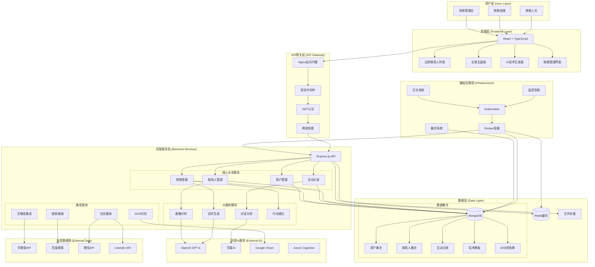
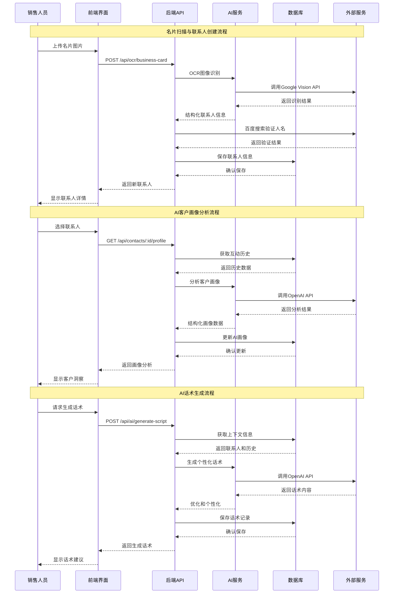
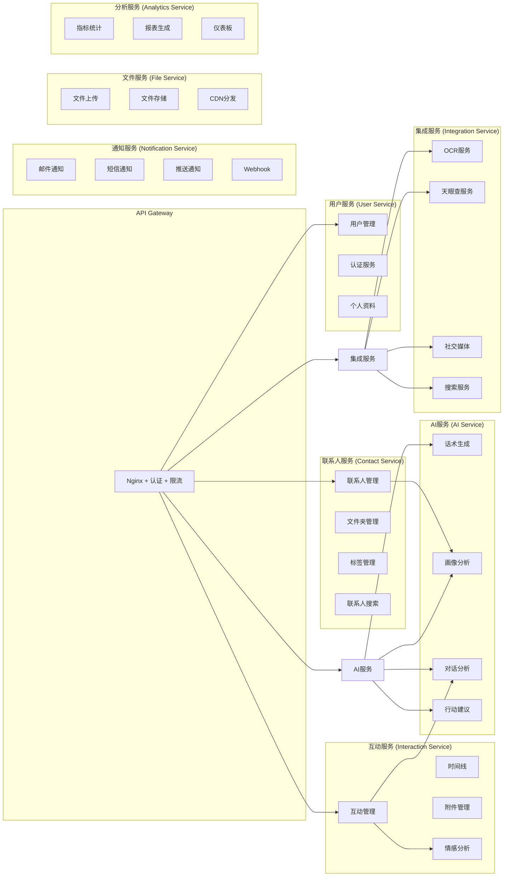
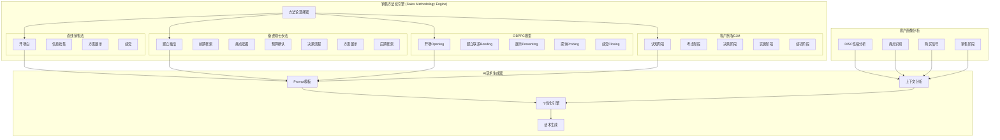
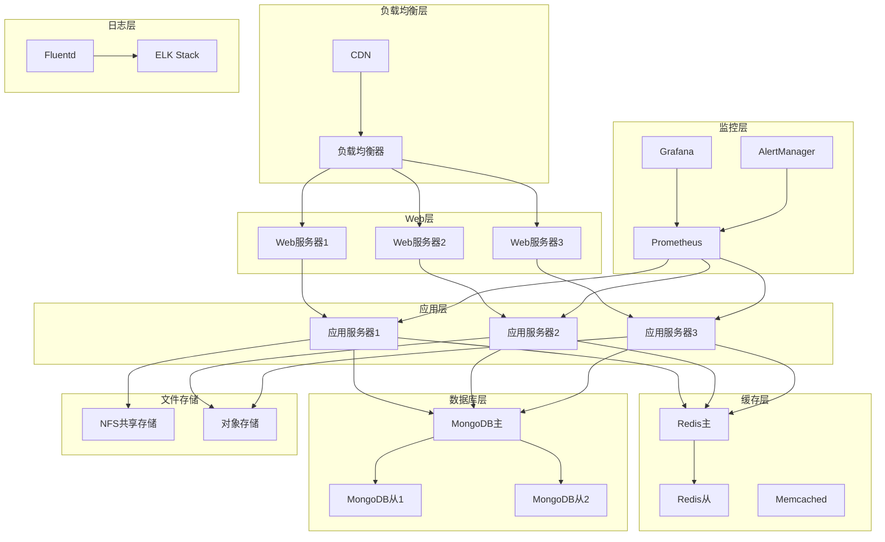
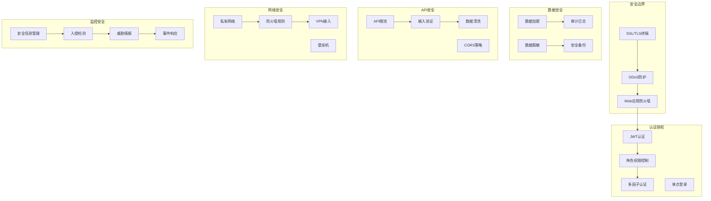

# AI-Driven CRM System Architecture Diagram

## 系统整体架构图

```mermaid
graph TB
    %% 用户层
    subgraph "用户层 (User Layer)"
        U1[销售人员]
        U2[销售经理]
        U3[系统管理员]
    end

    %% 前端层
    subgraph "前端层 (Frontend Layer)"
        FE[React + TypeScript]
        FE --> UI1[左侧联系人列表]
        FE --> UI2[右侧主面板]
        FE --> UI3[AI话术生成器]
        FE --> UI4[拖拽管理界面]
    end

    %% API网关层
    subgraph "API网关层 (API Gateway)"
        NGINX[Nginx反向代理]
        RATE[限流中间件]
        AUTH[JWT认证]
        CORS[跨域处理]
    end

    %% 后端服务层
    subgraph "后端服务层 (Backend Services)"
        API[Express.js API]
        
        subgraph "核心业务服务"
            CONTACT[联系人管理]
            INTERACT[互动记录]
            SALES[销售管理]
            USER[用户管理]
        end
        
        subgraph "AI服务模块"
            AI_SCRIPT[话术生成]
            AI_PROFILE[画像分析]
            AI_CONV[对话分析]
            AI_REC[行动建议]
        end
        
        subgraph "集成服务"
            OCR[OCR识别]
            SEARCH[搜索增强]
            TIANYAN[天眼查集成]
            SOCIAL[社交媒体]
        end
    end

    %% 外部AI服务
    subgraph "外部AI服务 (External AI)"
        OPENAI[OpenAI GPT-4]
        BAIDU[百度AI]
        GOOGLE[Google Vision]
        AZURE[Azure Cognitive]
    end

    %% 外部数据源
    subgraph "外部数据源 (External Data)"
        TYC[天眼查API]
        BAIDU_SEARCH[百度搜索]
        WECHAT[微信API]
        LINKEDIN[LinkedIn API]
    end

    %% 数据层
    subgraph "数据层 (Data Layer)"
        MONGO[(MongoDB)]
        REDIS[(Redis缓存)]
        FILES[文件存储]
        
        subgraph "数据集合"
            MONGO --> USERS[用户集合]
            MONGO --> CONTACTS[联系人集合]
            MONGO --> INTERACTIONS[互动记录]
            MONGO --> SCRIPTS[话术模板]
            MONGO --> AI_ANALYSIS[AI分析结果]
        end
    end

    %% 基础设施层
    subgraph "基础设施层 (Infrastructure)"
        DOCKER[Docker容器]
        K8S[Kubernetes]
        MONITOR[监控系统]
        LOG[日志系统]
        BACKUP[备份系统]
    end

    %% 连接关系
    U1 --> FE
    U2 --> FE
    U3 --> FE
    
    FE --> NGINX
    NGINX --> RATE
    RATE --> AUTH
    AUTH --> CORS
    CORS --> API
    
    API --> CONTACT
    API --> INTERACT
    API --> SALES
    API --> USER
    
    CONTACT --> AI_PROFILE
    INTERACT --> AI_CONV
    SALES --> AI_SCRIPT
    SALES --> AI_REC
    
    AI_SCRIPT --> OPENAI
    AI_PROFILE --> OPENAI
    AI_CONV --> BAIDU
    OCR --> GOOGLE
    
    SEARCH --> BAIDU_SEARCH
    TIANYAN --> TYC
    SOCIAL --> WECHAT
    SOCIAL --> LINKEDIN
    
    CONTACT --> MONGO
    INTERACT --> MONGO
    SALES --> MONGO
    USER --> MONGO
    
    API --> REDIS
    API --> FILES
    
    DOCKER --> API
    DOCKER --> MONGO
    DOCKER --> REDIS
    
    K8S --> DOCKER
    MONITOR --> K8S
    LOG --> K8S
    BACKUP --> MONGO
```

## 数据流架构图

```mermaid
sequenceDiagram
    participant U as 销售人员
    participant FE as 前端界面
    participant API as 后端API
    participant AI as AI服务
    participant DB as 数据库
    participant EXT as 外部服务

    %% 名片扫描流程
    Note over U,EXT: 名片扫描与联系人创建流程
    U->>FE: 上传名片图片
    FE->>API: POST /api/ocr/business-card
    API->>AI: OCR图像识别
    AI->>EXT: 调用Google Vision API
    EXT-->>AI: 返回识别结果
    AI-->>API: 结构化联系人信息
    API->>EXT: 百度搜索验证人名
    EXT-->>API: 返回验证结果
    API->>DB: 保存联系人信息
    DB-->>API: 确认保存
    API-->>FE: 返回新联系人
    FE-->>U: 显示联系人详情

    %% AI画像分析流程
    Note over U,EXT: AI客户画像分析流程
    U->>FE: 选择联系人
    FE->>API: GET /api/contacts/:id/profile
    API->>DB: 获取互动历史
    DB-->>API: 返回历史数据
    API->>AI: 分析客户画像
    AI->>EXT: 调用OpenAI API
    EXT-->>AI: 返回分析结果
    AI-->>API: 结构化画像数据
    API->>DB: 更新AI画像
    DB-->>API: 确认更新
    API-->>FE: 返回画像分析
    FE-->>U: 显示客户洞察

    %% 话术生成流程
    Note over U,EXT: AI话术生成流程
    U->>FE: 请求生成话术
    FE->>API: POST /api/ai/generate-script
    API->>DB: 获取上下文信息
    DB-->>API: 返回联系人和历史
    API->>AI: 生成个性化话术
    AI->>EXT: 调用OpenAI API
    EXT-->>AI: 返回话术内容
    AI-->>API: 优化和个性化
    API->>DB: 保存话术记录
    DB-->>API: 确认保存
    API-->>FE: 返回生成话术
    FE-->>U: 显示话术建议
```

## 微服务架构图

```mermaid
graph LR
    subgraph "API Gateway"
        GW[Nginx + 认证 + 限流]
    end

    subgraph "用户服务 (User Service)"
        US[用户管理]
        AUTH_SVC[认证服务]
        PROFILE[个人资料]
    end

    subgraph "联系人服务 (Contact Service)"
        CM[联系人管理]
        FOLDER[文件夹管理]
        TAG[标签管理]
        SEARCH_CONTACT[联系人搜索]
    end

    subgraph "互动服务 (Interaction Service)"
        IM[互动管理]
        TIMELINE[时间线]
        ATTACH[附件管理]
        SENTIMENT[情感分析]
    end

    subgraph "AI服务 (AI Service)"
        SCRIPT_GEN[话术生成]
        PROFILE_AI[画像分析]
        CONV_AI[对话分析]
        ACTION_AI[行动建议]
    end

    subgraph "集成服务 (Integration Service)"
        OCR_SVC[OCR服务]
        TIANYAN_SVC[天眼查服务]
        SOCIAL_SVC[社交媒体]
        SEARCH_SVC[搜索服务]
    end

    subgraph "通知服务 (Notification Service)"
        EMAIL[邮件通知]
        SMS[短信通知]
        PUSH[推送通知]
        WEBHOOK[Webhook]
    end

    subgraph "文件服务 (File Service)"
        UPLOAD[文件上传]
        STORAGE[文件存储]
        CDN[CDN分发]
    end

    subgraph "分析服务 (Analytics Service)"
        METRICS[指标统计]
        REPORT[报表生成]
        DASHBOARD[仪表板]
    end

    %% 连接关系
    GW --> US
    GW --> CM
    GW --> IM
    GW --> AI_SVC[AI服务]
    GW --> INTEGRATION[集成服务]
    
    CM --> PROFILE_AI
    IM --> CONV_AI
    IM --> SENTIMENT
    
    AI_SVC --> SCRIPT_GEN
    AI_SVC --> PROFILE_AI
    AI_SVC --> CONV_AI
    AI_SVC --> ACTION_AI
    
    INTEGRATION --> OCR_SVC
    INTEGRATION --> TIANYAN_SVC
    INTEGRATION --> SOCIAL_SVC
    INTEGRATION --> SEARCH_SVC
```

## 销售方法论集成架构

```mermaid
graph TD
    subgraph "销售方法论引擎 (Sales Methodology Engine)"
        SME[方法论选择器]
        
        subgraph "直线销售法"
            SL1[开场白]
            SL2[信息收集]
            SL3[方案展示]
            SL4[成交]
        end
        
        subgraph "桑德勒七步法"
            SD1[建立融洽]
            SD2[前期框架]
            SD3[痛点挖掘]
            SD4[预算确认]
            SD5[决策流程]
            SD6[方案展示]
            SD7[后期框架]
        end
        
        subgraph "OBPPC模型"
            OB1[开场Opening]
            OB2[建立联系Bonding]
            OB3[展示Presenting]
            OB4[探询Probing]
            OB5[成交Closing]
        end
        
        subgraph "客户旅程CJM"
            CJ1[认知阶段]
            CJ2[考虑阶段]
            CJ3[决策阶段]
            CJ4[实施阶段]
            CJ5[成功阶段]
        end
    end

    subgraph "AI话术生成器"
        PROMPT[Prompt模板]
        CONTEXT[上下文分析]
        PERSONAL[个性化引擎]
        GENERATE[话术生成]
    end

    subgraph "客户画像分析"
        DISC[DISC性格分析]
        PAIN[痛点识别]
        SIGNAL[购买信号]
        STAGE[销售阶段]
    end

    %% 连接关系
    SME --> SL1
    SME --> SD1
    SME --> OB1
    SME --> CJ1
    
    SL1 --> PROMPT
    SD1 --> PROMPT
    OB1 --> PROMPT
    CJ1 --> PROMPT
    
    DISC --> CONTEXT
    PAIN --> CONTEXT
    SIGNAL --> CONTEXT
    STAGE --> CONTEXT
    
    PROMPT --> PERSONAL
    CONTEXT --> PERSONAL
    PERSONAL --> GENERATE
```

## 部署架构图

```mermaid
graph TB
    subgraph "负载均衡层"
        LB[负载均衡器]
        CDN[CDN]
    end

    subgraph "Web层"
        WEB1[Web服务器1]
        WEB2[Web服务器2]
        WEB3[Web服务器3]
    end

    subgraph "应用层"
        APP1[应用服务器1]
        APP2[应用服务器2]
        APP3[应用服务器3]
    end

    subgraph "缓存层"
        REDIS1[Redis主]
        REDIS2[Redis从]
        MEMCACHE[Memcached]
    end

    subgraph "数据库层"
        MONGO_PRIMARY[MongoDB主]
        MONGO_SECONDARY1[MongoDB从1]
        MONGO_SECONDARY2[MongoDB从2]
    end

    subgraph "文件存储"
        NFS[NFS共享存储]
        OSS[对象存储]
    end

    subgraph "监控层"
        PROMETHEUS[Prometheus]
        GRAFANA[Grafana]
        ALERTMANAGER[AlertManager]
    end

    subgraph "日志层"
        ELK[ELK Stack]
        FLUENTD[Fluentd]
    end

    %% 连接关系
    CDN --> LB
    LB --> WEB1
    LB --> WEB2
    LB --> WEB3
    
    WEB1 --> APP1
    WEB2 --> APP2
    WEB3 --> APP3
    
    APP1 --> REDIS1
    APP2 --> REDIS1
    APP3 --> REDIS1
    
    REDIS1 --> REDIS2
    
    APP1 --> MONGO_PRIMARY
    APP2 --> MONGO_PRIMARY
    APP3 --> MONGO_PRIMARY
    
    MONGO_PRIMARY --> MONGO_SECONDARY1
    MONGO_PRIMARY --> MONGO_SECONDARY2
    
    APP1 --> NFS
    APP2 --> OSS
    APP3 --> OSS
    
    PROMETHEUS --> APP1
    PROMETHEUS --> APP2
    PROMETHEUS --> APP3
    
    GRAFANA --> PROMETHEUS
    ALERTMANAGER --> PROMETHEUS
    
    FLUENTD --> ELK
```

## 安全架构图

```mermaid
graph TB
    subgraph "安全边界"
        WAF[Web应用防火墙]
        DDoS[DDoS防护]
        SSL[SSL/TLS终端]
    end

    subgraph "认证授权"
        JWT_AUTH[JWT认证]
        RBAC[角色权限控制]
        MFA[多因子认证]
        SSO[单点登录]
    end

    subgraph "数据安全"
        ENCRYPT[数据加密]
        MASK[数据脱敏]
        AUDIT[审计日志]
        BACKUP[安全备份]
    end

    subgraph "API安全"
        RATE_LIMIT[API限流]
        VALIDATION[输入验证]
        SANITIZE[数据清洗]
        CORS_POLICY[CORS策略]
    end

    subgraph "网络安全"
        VPC[私有网络]
        FIREWALL[防火墙规则]
        VPN[VPN接入]
        BASTION[堡垒机]
    end

    subgraph "监控安全"
        SIEM[安全信息管理]
        IDS[入侵检测]
        THREAT[威胁情报]
        INCIDENT[事件响应]
    end

    %% 连接关系
    WAF --> JWT_AUTH
    DDoS --> WAF
    SSL --> DDoS
    
    JWT_AUTH --> RBAC
    RBAC --> MFA
    
    ENCRYPT --> AUDIT
    MASK --> BACKUP
    
    RATE_LIMIT --> VALIDATION
    VALIDATION --> SANITIZE
    
    VPC --> FIREWALL
    FIREWALL --> VPN
    
    SIEM --> IDS
    IDS --> THREAT
    THREAT --> INCIDENT
```